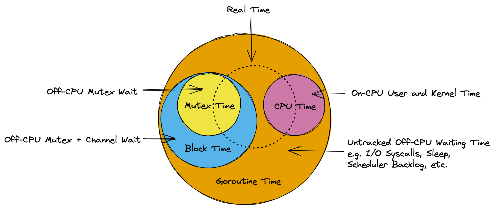

li⬅ [Index of all go-profiler-notes](../README.md)
# 一份给忙碌开发者的 Go Profiling、Tracing 和 Observability 指南

- **[导论](#introduction):** [适合读者](#read-this) · [Go 的认知模型](#mental-model-for-go) · Profiling vs Tracing
- **Use Cases:** Reduce Costs · Reduce Latency · Memory Leaks · Program Hanging · Outages
- **[Go 分析器](#go-profilers)**: [CPU 分析器](#cpu-profiler) · [内存分析器](#memory-profiler) · [阻塞分析器](#block-profiler) · [互斥锁分析器](#mutex-profiler) · [Goroutine分析器](#goroutine-profiler) · [线程创建分析器](#threadcreate-profiler)
- **Viewing Profiles**: Command Line · Flame Graph · Graph
- **Go Execution Tracer:** Timeline View · Derive Profiles
- **Go Metrics:**  MemStats
- **Other Tools:** time · perf · bpftrace
- **[Advanced Topics](#advanced-topics):** Assembly · [Stack Traces](#stack-traces) · [pprof Format](#pprof-format) · Little's Law
- **Datadog Products:** Continuous Profiler · APM (Distributed Tracing) · Metrics

🚧 本文档正在进行中。随着时间的推移，以上所有部分都将成为可点击的链接。了解最新动态的最佳方式是关注我和[我在 twitter 上的帖子](https://twitter.com/felixge/status/1435537024388304900)，我将在上面宣布添加的内容。

# 导论

## 适合的读者

这是一本面向有兴趣使用分析(profiling)、跟踪(tracing)和其他可观察性技术(observability techniques)来改进程序的忙碌的Gophers的实用指南。如果你不熟悉 Go 的内部结构，建议你先阅读整个介绍。之后，你可以跳到你任意感兴趣的部分。

## Go 的认知模型

在不了解 Go 语言的底层工作原理的情况下，你可能会非常精通编写 Go 程序代码。但当涉及到性能和调试问题时，你将会从Go内部的认知模型中受益匪浅。因此我们将首先在下面列出 Go 的基本模型。这个模型应该足够好，可以让你避免最常见的错误，但[All models are wrong](https://en.wikipedia.org/wiki/All_models_are_wrong)，因此鼓励你寻找更深入的资料来解决未来更难的问题。

Go 的主要工作是复用(multiplex)和抽象硬件资源(abstract hardware resources)，它类似于操作系统。Go 通常使用下面两个主要抽象来完成：

1. **Goroutine 调度器：** 用于控制代码如何在系统 CPU 上的执行

2. **垃圾回收：** 提供可以根据需要自动释放的虚拟内存

### Goroutine 调度器

我们使用下面这个例子来讨论调度器：

```go
func main() {
    res, err := http.Get("https://example.org/")
    if err != nil {
        panic(err)
    }
    fmt.Printf("%d\n", res.StatusCode)
}
```

这里我们有一个单独的 goroutine，我们称之为 G1，它运行 main 函数。下图显示了这个 goroutine 如何在单个 CPU 上执行的简化版时间线。最初 G1 在 CPU 上运行以准备 http 请求。然后 CPU 变得空闲，因为 goroutine 必须等待网络。最后，它再次被调度到 CPU 上以打印出状态码。


从调度器的角度来看，上面的程序执行过程如下所示。一开始 G1 在 CPU 1 上执行。接着 goroutine 在由于等待网络时会从 CPU 中taken off。一旦调度器注意到网络已经响应（使用非阻塞 I/O，类似于 Node.js），它会将 goroutine 标记为 `Runnable`。一旦 CPU 内核可用，goroutine 就会再次开始执行。在我们的例子中，所有内核都处于可用状态，因此 G1 可以立即返回到在其中一个 CPU 上执行 fmt.Printf() 函数，而无需花费任何时间处于 `Runnable` 状态。


大多数时候，Go 程序都在运行多个 goroutine，所以会有几个 goroutine 正在执行在 CPU 内核上，有大量 goroutine 由于各种原因处于`Waiting`，在理想情况下没有 goroutine 处于`Ruannable` 状态，除非你的程序表现出非常高的 CPU 负载。这方面的一个例子可以在下面看到。


当然，上面的模型掩盖了许多细节。实际上，如同龟壳上的世界(it's turtles all the way down)，你会发现Go 调度程序工作在操作系统管理的线程之上，甚至 CPU 本身也能够进行超线程处理，这可以看作是一种调度形式。如果你有对此感兴趣的话，可以去阅读 Ardan 实验室[关于 Go 调度](https://www.ardanlabs.com/blog/2018/08/scheduling-in-go-part1.html)系列文章或类似资料。

不管怎么说，上面的模型应该足以理解本指南的其余部分。我们尤其应该清楚的是，各种 Go 分析器测量的时间本质上是你的 goroutine 在执行和等待状态中花费的时间，如下图所示。



### 垃圾回收器

Go 中的另一个主要抽象是垃圾回收器。像 C 这样的语言，程序员需要使用 `malloc()` 和 `free()` 手动处理内存的分配和释放。这提供了很好的控制，但在实践中很容易出错。垃圾回收器可以减轻这种负担，但内存的自动管理很容易成为性能瓶颈。本指南的这一部分将展示一个简单的 Go GC 模型，该模型对于识别和优化内存管理相关问题应该很有用。

#### 栈

让我们从基础开始。 Go 可以在堆栈(stack)或堆(heap)这两个地方之一分配内存。每个 goroutine 都有自己的堆栈，这是一个连续的内存区域。此外，在 goroutine 之间共享的一大块内存区域称为堆。Go的堆栈和堆如下图所示：


当一个函数调用另一个函数时候，它将会从栈上获得自己的空间，这部分空间叫做栈帧(stack frame)，栈帧是用来存局部变量等内容。栈指针用于标识帧中的下一个空闲点。当函数返回时，只需将堆栈指针移回前一帧的末尾即可丢弃最后一帧的数据。栈帧上的数据本身可以在栈上存放，并被下一个函数调用覆盖。这是非常简单和高效的，因为 Go 不必跟踪每个变量。

为了上面讨论更直观一点，让我们来看下面的例子：

```go
func main() {
	sum := 0
	sum = add(23, 42)
	fmt.Println(sum)
}

func add(a, b int) int {
	return a + b
}
```

这里我们有一个 `main()` 函数，它首先在栈上为变量 `sum` 保留一些空间。当 `add()` 函数被调用时，它会使用自己的栈帧空间来保存本地 `a` 和 `b` 参数。一旦 `add()` 返回，它的数据通过将栈指针移回到 `main()` 函数帧的末尾而被丢弃，并且 `sum` 变量被更新为函数`add()`的返回值。同时 `add()` 的旧值在堆栈指针之外徘徊，将被下一个函数调用覆盖。下面是这个过程的可视化：


上面的例子是高度简化的，省略了很多关于返回值、帧指针、返回地址和函数内联的细节。事实上，从 Go 1.17 开始，上面的程序甚至可能不需要堆栈上的任何空间，因为编译器可以使用 CPU 寄存器管理少量数据。但是没关系。这个模型仍然能够让你对非凡的 Go 程序在堆栈上分配和丢弃局部变量的方式有一个直观感受。

你可能想知道如果栈空间不足时候将会发生什么情况？在 C 这样的语言中，它将会导致栈溢出错误（stack overflow error）。然后 Go 是通过复制出两倍大的堆栈来自动处理这个问题，这种方式允许 goroutines 可以从很小的栈空间开始，通常为 2 KiB，也是使 [goroutines 比操作系统线程更具可扩展性](https://golang.org/doc/faq#goroutines)的关键因素之一。

栈的另一个方面是它如何参与创建堆栈跟踪。这话题有点复杂，但如果你有兴趣，请查看此仓库中的关于 [Go 栈跟踪](https://github.com/DataDog/go-profiler-notes/blob/main/stack-traces.md)部分文档。

#### 堆

栈分配很好，但在很多情况下 Go 无法使用它们。最常见的是返回指向函数局部变量的指针。这可以在上面的 add() 示例的修改版本中看到：

```go
func main() {
	fmt.Println(*add(23, 42))
}

func add(a, b int) *int {
	sum := a + b
	return &sum
}
```

通常 Go 将能够在栈上为 `add()` 函数内部的 `sum` 变量分配空间。但正如我们上面介绍的那样，当 `add()` 函数返回时，这些数据会被丢弃。因此，为了安全地返回 `&sum` 指针，Go 必须从栈外部为其分配内存。这就是堆的用武之地。

堆用于存储可能比创建它的函数生命周期更长的数据，以及使用指针在 goroutine 之间共享的任何数据。然而这就涉及了如何释放这些内存的问题。因为与栈分配不同，堆分配在创建它们的函数返回时不能被丢弃(discard)。

Go 使用其内置的垃圾回收器(built-in garbage collector)解决了这个问题。它的实现细节非常复杂，但从俯瞰的角度来看，如下图所示，它会跟踪应用程序的内存。下图中，你可以看到三个 goroutine，他们都有指针指向堆上的绿色区域，其中的一些区域还会指向其他的绿色区域。此外，还有指向绿色区域的灰色区域，或者相互指向的灰色区域，但它们不被绿色区域本身引用。这些灰色曾经是可以访问的，但现在被认为是垃圾。如果在堆栈上分配指针的函数返回，或者它们的值被覆盖，就会发生这种情况。 GC 负责自动识别和释放这些区域。


执行 GC 操作涉及大量性能损耗在的图遍历(graph traversal)和缓存抖动(cache thrashing)。它甚至需要定期停止整个程序的执行阶段。幸运的是，最近的 Go 版本已将其降低到几分之一毫秒，但大部分剩余开销是任何 GC 所固有的。事实上，Go 程序中 20-30% 的执行花费在内存管理上的情况并不少见。

一般来说，GC 的成本与程序执行的堆分配量成正比。因此，在优化程序的内存相关开销时，口头禅是：

- **减少使用：** 尝试将堆分配转换为栈分配或完全避免它们。最小化堆上的指针数量也会有所帮助。

- **复用：** 复用分配的堆而不是使用新的来替换它们。

- **回收：** 一些堆分配是无法避免的。让 GC 回收它们并专注于其他问题。

与本指南中之前的认知模型一样，以上所有内容都是对现实的极其简化的概览，但希望它足以让本指南的其余部分变得有意义，并激励你阅读更多关于该主题的文章。你绝对应该阅读的一篇文章是 [Getting to Go: The Journey of Go's Garbage Collector](https://go.dev/blog/ismmkeynote)，它让你很好地了解 Go 的 GC 多年来是如何发展的，以及它的改进速度。

# Go 分析器

下面是 Go 运行时中内置的分析器的概述。有关更多详细信息，请访问后面的链接。

| | [CPU](#cpu-profiler) | [内存(Memory)](#memory-profiler) | [阻塞(Block)](#block-profiler) | [互斥锁(Mutex)](#mutex-profiler) | [Goroutine](#goroutine-profiler) | [线程创建(ThreadCreate)](#threadcreate-profiler) |
|-|-|-|-|-|-|-|
|生产环境使用安全性(Production Safety)|✅|✅|⚠ (1.)|✅|⚠️ (2.)|🐞 (3.)|
|安全率(Safe Rate)|default|default|❌ (1.)|`100`|`1000` goroutines|-|
|准确性(Accuracy)|⭐️⭐|⭐⭐⭐|⭐⭐⭐|⭐⭐⭐|⭐⭐⭐|-|
|最大栈深度(Max Stack Depth)|`64`|`32`|`32`|`32`|`32` - `100` (4.)|-|
|分析器标签支持(Profiler Labels)|✅|❌|❌|❌|✅|-|

1. 如果配置不正确，阻塞分析器(block profiler)可能是 CPU 开销的重要来源。详情[见警告]。(#block-profiler-limitations)。
2. O(N) 次的stop-the-world，N是goroutines的数量，每个goroutine暂停耗时~1-10µsec。
3. 不要尝试使用。
4. 取决于 API。

<!-- TODO mega snippet to enable all profilers -->

## CPU 分析器

Go 的 CPU 分析器可以帮助你找出代码中的哪些部分消耗大量 CPU 时间。

⚠️ 请注意，CPU 时间通常不同于用户实际体验的时间（也称为延迟）。例如，一个典型的 http 请求可能需要 100 毫秒才能完成，但在数据库上等待 95 毫秒时只消耗 5 毫秒的 CPU 时间。如果两个 goroutine 并行执行 CPU 密集型工作，请求也可能需要 100 毫秒，但会花费 200 毫秒的 CPU。如果这让你感到困惑，请参阅 [Goroutine 调度器](#goroutine-scheduler)部分。

你可以通过各种 API 控制 CPU 分析器：

- `go test -cpuprofile cpu.pprof` will run your tests and write a CPU profile to a file named `cpu.pprof`.
- [`pprof.StartCPUProfile(w)`](https://pkg.go.dev/runtime/pprof#StartCPUProfile) captures a CPU profile to `w` that covers the time span until [`pprof.StopCPUProfile()`](https://pkg.go.dev/runtime/pprof#StopCPUProfile) is called.
- [`import _ "net/http/pprof"`](https://pkg.go.dev/net/http/pprof) allows you to request a 30s CPU profile by hitting the `GET /debug/pprof/profile?seconds=30` endpoint of the default http server that you can start via `http.ListenAndServe("localhost:6060", nil)`.
- [`runtime.SetCPUProfileRate()`](https://pkg.go.dev/runtime#SetCPUProfileRate) lets you to control the sampling rate of the CPU profiler. See [CPU Profiler Limitations](#cpu-profiler-limitations) for current limitations.
- [`runtime.SetCgoTraceback()`](https://pkg.go.dev/runtime#SetCgoTraceback) can be used to get stack traces into cgo code. [benesch/cgosymbolizer](https://github.com/benesch/cgosymbolizer) has an implementation for Linux and macOS.

如果你需要一个快速的代码片段来粘贴到你的 main() 函数中，你可以使用下面的代码：

```go
file, _ := os.Create("./cpu.pprof")
pprof.StartCPUProfile(file)
defer pprof.StopCPUProfile()
```

无论你如何触发 CPU 分析器，生成的profile文件本质上都是以二进制 [pprof](../pprof.md) 格式格式化的堆栈跟踪表。这种表格的简化版本如下所示：

|stack trace|samples/count|cpu/nanoseconds|
|-|-|-|
|main;foo|5|50000000|
|main;foo;bar|3|30000000|
|main;foobar|4|40000000|

CPU 分析器通过操作系统监控应用程序的CPU 使用情况，并且每隔`10ms`的CPU 片时间发送一个`SIGPROF`信号来捕获profile数据。操作系统还包括内核在此监控中代表应用程序消耗的时间。由于信号传输速率取决于 CPU 消耗，因此它是动态的，最高可达 `N * 100Hz`，其中 `N` 是操作系统上逻辑 CPU 内核的数量。当 `SIGPROF` 信号到达时，Go 的信号处理程序捕获当前活动的 goroutine 的堆栈跟踪，并增加profile文件中的相应值。 `cpu/nanoseconds` 值目前是直接从`samples/count`样本计数中推导出来的，所以是多余的，但是使用方便。

### CPU 分析器标签

Go 的 CPU 分析器的一个很酷的功能是你可以将任意键值对附加到 goroutine。这些标签将被从该 goroutine 生成的任何 goroutine 继承，并写入到profile文件中。

让我们考虑下面的例子，它代表用户执行一些 CPU `work()`。通过使用 [pprof.Labels()](https://pkg.go.dev/runtime/pprof#Labels) 和 [pprof.Do()](https://pkg.go.dev/runtime/pprof#Do) API，我们可以将用户与执行 work() 函数的 goroutine 相关联。该标签会被同一代码块中生成的任何 goroutine 自动继承，例如 `backgroundWork()`这个goroutine。

```go
func work(ctx context.Context, user string) {
	labels := pprof.Labels("user", user)
	pprof.Do(ctx, labels, func(_ context.Context) {
		go backgroundWork()
		directWork()
	})
}
```
生成的profile文件中将包含一个新的标签列，可能如下所示：

|stack trace|label|samples/count|cpu/nanoseconds|
|-|-|-|-|
|main.childWork|user:bob|5|50000000|
|main.childWork|user:alice|2|20000000|
|main.work;main.directWork|user:bob|4|40000000|
|main.work;main.directWork|user:alice|3|30000000|

使用 pprof 的 Graph 视图查看相同的profile文件也将包括标签：


如何使用这些标签取决于你。你可能会包含诸如`user ids`、`request ids`、`http endpoints`、`subscription plan`或其他数据之类的内容，这些数据可以让你更好地了解哪些类型的请求会导致 CPU 的高负载。即使它们是由相同的代码处理的路径，话虽如此，使用标签会增加 pprof 文件的大小。因此，一旦你确信它们不会影响应用程序的性能，你可能应该从类似`http endpoints`等低基数(low cardinality)标签开始，然后再转向高基数(high cardinality)标签。

⚠️ Go 1.17 及更低版本包含几个可能导致 CPU profile文件中缺少某些分析器标签的错误，有关更多信息，请参阅[CPU 分析器的限制](#cpu-profiler-limitations)。

### CPU 利用率

由于 CPU 分析器的采样率会适应你的程序消耗的 CPU 的数量，因此你可以从 CPU profile文件中得出 CPU 利用率。事实上 pprof 会自动为你做这件事。例如，下面的profile文件显示程序的平均 CPU 利用率为 `147.77%` ：

```
$ go tool pprof guide/cpu-utilization.pprof
Type: cpu
Time: Sep 9, 2021 at 11:34pm (CEST)
Duration: 1.12s, Total samples = 1.65s (147.77%)
Entering interactive mode (type "help" for commands, "o" for options)
(pprof) 
```

表示 CPU 利用率的另一种流行方式是 CPU 核数。在上面的示例中，程序在分析期间平均使用了 1.47 个 CPU 内核。

⚠️ 在 Go 1.17 及以下版本中，如果它接近或高于 `250%`，你不要过于相信这个数字，请参阅[CPU 分析器的限制](#cpu-profiler-limitations)。但是，如果你看到一个非常低的数字（例如 10%），这通常表明 CPU 消耗对你的应用程序来说不是问题。一个常见的错误是忽略此数字并开始担心特定功能相对于profile的其余部分会占用很长时间。当整体 CPU 利用率较低时，这通常是浪费时间，因为优化此功能并不能获得太多收益。

### CPU profile文件中的系统调用

如果你在 CPU profile文件中看到诸如 `syscall.Read()` 或 `syscall.Write()` 之类的系统调用使用大量时间，请注意这只是内核中这些函数内部花费的 CPU 时间。I/O 时间本身没有被追踪。在系统调用上花费大量时间通常表明调用过多，因此增加缓冲区大小可能会有所帮助。对于像这样更复杂的情况，你应该考虑使用 Linux perf，因为它还可以向你显示内核堆栈跟踪，这可能会为你提供额外的线索。

<!-- TODO: Write up some implementation details, e.g. mention setitimer(). -->
### CPU 分析器的限制

有一些已知的CPU分析器的问题和限制，你应该知道和了解：

- 🐞 [GH #35057](https://github.com/golang/go/issues/35057): 对于使用超过 2.5 个 CPU 内核的程序，使用 Go 版本 <= 1.17 获取的 CPU profile文件变得有些不准确。一般来说，总体 CPU 利用率将被低估，并且工作负载峰值也可能在生成的profile文件中被低估。这在 Go 1.18 中已修复。同时，你可以尝试使用 Linux perf 作为解决方法。
- 🐞 Go 版本 <= 1.17 中的 分析器 标签存在几个错误。
  - [GH #48577](https://github.com/golang/go/issues/48577) and [CL 367200](https://go-review.googlesource.com/c/go/+/367200/): 当goroutine执行在系统栈，执行C代码或者进行系统调用时候，将会丢失分析器标签。
  - [CL 369741](https://go-review.googlesource.com/c/go/+/369741): CPU profile文件中的第一批样本有一个错误，导致标签分配错误。
  - [CL 369983](https://go-review.googlesource.com/c/go/+/369983): 代表用户级 goroutine（例如用于垃圾收集）创建的系统级 goroutine 错误地继承了它们的父标签。
- ⚠️️ 你可以在调用 `runtime.StartCPUProfile()` 之前调用 `runtime.SetCPUProfileRate()` 来调整 CPU 分析器速率。这将打印一条警告：`runtime: cannot set cpu profile rate until previous profile has finished`。但是，它仍然可以在上述错误的限制范围内工作。此问题最初是在[此issue](https://github.com/golang/go/issues/40094)中提出的，并且已有一个[已接受的改进 API](https://github.com/golang/go/issues/42502)的提案。
- ⚠️ CPU 分析器可以在堆栈跟踪中捕获的最大嵌套函数调用数目前为 [64](https://sourcegraph.com/search?q=context:global+repo:github.com/golang/go+file:src/*+maxCPUProfStack+%3D&patternType=literal)。如果你的程序使用大量递归(recursion)或其他导致堆栈深度更深的模式，你的 CPU profile文件中的栈跟踪将会被截断。这意味着你将错过调用链的某些部分，这些部分是在采样时处于活动状态的函数。

## 内存分析器

Go 的内存分析器可以帮助你确定代码中的哪些部分执行了大量的堆分配，以及在上次垃圾回收期间这些分配的内存中有多少仍然可以访问。因此，内存分析器生成的profile文件也通常称为堆 profile文件。

与堆内存管理相关的活动通常占 Go 进程消耗的 CPU 时间的 20-30%。此外，由于减少了垃圾回收器必须扫描堆时发生的缓存抖动量，因此消除堆分配可能会产生二阶效应(second order effects)，从而加快代码的其他部分。这意味着优化内存分配通常可以比优化程序中的 CPU密集型(CPU-bound)的代码路径获得更好的投资回报。

⚠️ 内存分析器不显示栈分配，因为它们成本通常比堆分配便宜得多。有关详细信息，请参阅[垃圾回收器](#garbage-collector)部分。

你可以通过各种 API 控制内存分析器：

- `go test -memprofile mem.pprof` will run your tests and write a memory profile to a file named `mem.pprof`.
- [`pprof.Lookup("allocs").WriteTo(w, 0)`](https://pkg.go.dev/runtime/pprof#Lookup) writes a memory profile that contains allocation events since the start of the process to `w`.
- [`import _ "net/http/pprof"`](https://pkg.go.dev/net/http/pprof) allows you to request a 30s memory profile by hitting the `GET /debug/pprof/allocs?seconds=30` endpoint of the default http server that you can start via `http.ListenAndServe("localhost:6060", nil)`. This is also called a delta profile internally.
- [`runtime.MemProfileRate`](https://pkg.go.dev/runtime#MemProfileRate) lets you to control the sampling rate of the memory profiler. See [Memory Profiler Limitations](#memory-profiler-limitations) for current limitations.

如果你需要一个快速的代码片段来粘贴到你的 `main()` 函数中，你可以使用下面的代码：

```go
file, _ := os.Create("./mem.pprof")
defer pprof.Lookup("allocs").WriteTo(file, 0)
defer runtime.GC()
```

无论你如何启用内存分析器，生成的profile文件本质上都是以二进制 [pprof](../pprof.md) 格式格式化的堆栈跟踪表。这种表格的简化版本如下所示：

|stack trace|alloc_objects/count|alloc_space/bytes|inuse_objects/count|inuse_space/bytes|
|-|-|-|-|-|
|main;foo|5|120|2|48|
|main;foo;bar|3|768|0|0|
|main;foobar|4|512|1|128|

内存profile文件包含下面两个主要信息：

- `alloc_*`: The amount of allocations that your program has made since the start of the process (or profiling period for delta profiles).
  自进程开始（或增量profile文件的分析周期）以来，你的程序已进行的分配量。
- `inuse_*`: The amount of allocations that your program has made that were still reachable during the last GC.
  你的程序在上次 GC 期间仍可访问的分配量。

你可以将这些信息用于各种目的。例如，你可以使用 `alloc_*` 数据来确定哪些代码路径可能会产生大量垃圾供 GC 处理，并且随着时间的推移查看 `inuse_*` 数据可以帮助你分析程序中内存泄漏或高内存使用情况。

<!-- TODO: mention profiles are up to two gcs old -->
### 分配Profile 和 堆Profile

[`pprof.Lookup()`](https://pkg.go.dev/runtime/pprof#Lookup) 函数以及 [net/http/pprof](https://pkg.go.dev/net/http/pprof) 包以两个名称公开内存profile文件：`allocs` 和 `heap`。两个profile文件包含相同的数据，唯一的区别是 `allocs` profile文件将 `alloc_space/bytes` 设置为默认样本类型，而`heap` profile文件默认为 `inuse_space/bytes`。 pprof 工具使用它来决定默认显示哪种样本类型。

### 内存分析器采样

为了保持较低的开销，内存分析器使用泊松采样(poisson sampling)，因此平均每 `512KiB` 只有一个分配触发堆栈跟踪以被获取并添加到profile文件中。但是，在将profile文件写入最终 pprof 文件之前，运行时通过将收集的样本值除以采样概率来缩放它们。这意味着报告的分配量应该是对实际分配量的良好估计，无论你使用的是什么 [`runtime.MemProfileRate`](https://pkg.go.dev/runtime#MemProfileRate)。

对于生产中的内存分析，你通常不必修改采样率。这样做的唯一理由是，如果你担心在内存分配很少的情况下收集到的样本不足。

### 内存使用与 RSS

一个常见的混淆是查看 `inuse_space/bytes` 样本类型报告的内存总量，并注意到它与操作系统报告的 `RSS` 内存使用情况不匹配。这有多种原因：

- 按照RSS定义，它不仅仅包括 Go 堆内存，还包括goroutine 栈使用的内存、以及程序可执行文件或共享库以及 C 函数分配的内存。
- Go GC 之后并不会立即将空闲内存返回给操作系统，但这在 Go 1.16 [运行时更改后](https://golang.org/doc/go1.16#runtime)应该是一个较小的问题。
- Go 使用非移动 GC，因此在某些情况下，空闲堆内存可能会以碎片化(fragmented)形式阻止 Go 将其释放到操作系统。


### 内存分析器实现

下面的伪代码(pseudo code)展示内存分析器实现的基本思路，以便为你提供更好的直觉。如你所见，Go 运行时内部的 `malloc()` 函数使用 `poisson_sample(size)` 来确定是否应对该次内存分配进行采样。如果是，则获取堆栈跟踪 `s` 并将其用作 `mem_profile` 哈希表中的键，以增加 `allocs` 和 `alloc_bytes` 计数器。此外，`track_profiled(object, s)` 调用将对象标记为堆上的采样分配，并将堆栈跟踪 `s` 与它相关联。

```
func malloc(size):
  object = ... // allocation magic

  if poisson_sample(size):
    s = stacktrace()
    mem_profile[s].allocs++
    mem_profile[s].alloc_bytes += size
    track_profiled(object, s)

  return object
```

当 GC 确定是时候释放分配的对象时，它会调用使用 `is_profiled(object)` 的 `sweep()` 来检查对象是否被标记为采样对象。如果是，它会检索导致分配的堆栈跟踪，并在 `mem_profile` 中为它增加 `frees` 和 `free_bytes` 计数器。

```
func sweep(object):
  if is_profiled(object)
    s = alloc_stacktrace(object)
    mem_profile[s].frees++
    mem_profile[s].free_bytes += sizeof(object)

	// deallocation magic
```

`free_*` 计数器本身并不包含在最终的内存profile文件中。相反，它们用于通过简单的 `allocs - frees` 运算得到 `inuse_*`。此外，最终输出值通过将它们除以它们的采样概率来缩放。

### 内存分析器的限制

你可能需要了解内存分析器的一些已知问题和限制：

- 🐞 [GH #49171](https://github.com/golang/go/issues/49171): 由于 Go 1.17 中的涉及内联闭包的符号化错误，Delta profiles（使用例如 `GET /debug/pprof/allocs?seconds=60`）可能会报告负分配计数。这个问题已在 Go 1.18 中修复。
- ⚠️ [`runtime.MemProfileRate`](https://pkg.go.dev/runtime#MemProfileRate) 只能在程序启动时修改一次；例如，在 `main()`函数开始时候。写入这个值会有一个小的数据竞争，并且在程序执行期间多次更改它会产生不正确的profile文件。
- ⚠ 在调试潜在的内存泄漏(debugging potential memory leaks)时，内存分析器可以显示这些分配是在哪里创建的，但它不能显示哪些引用使它们保持活动状态。多年来，为解决这个问题进行了一些尝试，但没有一个适用于最新版本的 Go。如果你知道一个可用的工具，[请告诉我](https://github.com/DataDog/go-profiler-notes/issues)。
- ⚠ 内存分析器不支持 CPU 分析器标签或类似标签。很难将此功能添加到当前实现中，因为它可能会在保存内存分析数据的内部哈希表中造成内存泄漏。
- ⚠ cgo 中 C 代码所做的内存分配不会显示在内存profile文件中。
- ⚠ 内存profile文件数据可能最多有两个垃圾回收周期。如果你想要更一致的时间点快照(point-in-time snapshot)，请考虑在请求内存profile文件之前调用 `runtime.GC()`。 [net/http/pprof](https://pkg.go.dev/net/http/pprof) 的 `?gc=1` 参数可以实现这个目的。有关更多信息，请参阅 [runtime.MemProfile()](https://pkg.go.dev/runtime#MemProfile) 文档以及 [`mprof.go`](https://github.com/golang/go/blob/master/src/runtime/mprof.go) 中对 `memRecord` 的评论。

- ⚠️ 内存分析器可以在栈跟踪中捕获的最大嵌套函数调用数目前为 [`32`](https://sourcegraph.com/search?q=context:global+repo:github.com/golang/go+file:src/*+maxStack+%3D&patternType=literal)，有关超过此限制时会发生什么的更多信息，请参阅 [CPU 分析器限制](#cpu-profiler-limitations)。

- ⚠️ 保存内存profile文件的内部哈希表没有大小限制。这意味着它将不断增长，直到覆盖代码中的所有内存分配代码的路径。这在实践中不是问题，但如果你正在观察进程的内存使用情况，它可能看起来像一个小的内存泄漏。


## 阻塞分析器

Go 中的阻塞分析器衡量你的 goroutine 在等待通道以及[sync包](https://pkg.go.dev/sync)提供的互斥操作时在 Off-CPU 外花费的时间。以下 Go 操作会被阻塞分析器捕获分析：

- [select](https://github.com/golang/go/blob/go1.15.7/src/runtime/select.go#L511)
- [chan send](https://github.com/golang/go/blob/go1.15.7/src/runtime/chan.go#L279)
- [chan receive](https://github.com/golang/go/blob/go1.15.7/src/runtime/chan.go#L586)
- [semacquire](https://github.com/golang/go/blob/go1.15.7/src/runtime/sema.go#L150) ( [`Mutex.Lock`](https://golang.org/pkg/sync/#Mutex.Lock), [`RWMutex.RLock`](https://golang.org/pkg/sync/#RWMutex.RLock) , [`RWMutex.Lock`](https://golang.org/pkg/sync/#RWMutex.Lock), [`WaitGroup.Wait`](https://golang.org/pkg/sync/#WaitGroup.Wait))
- [notifyListWait](https://github.com/golang/go/blob/go1.15.7/src/runtime/sema.go#L515) ( [`Cond.Wait`](https://golang.org/pkg/sync/#Cond.Wait))

⚠️ 阻塞 profile文件不包括等待 I/O、睡眠、GC 和各种其他等待状态的时间。此外，阻塞事件在完成之前不会被记录，因此阻塞profile文件不能用于调试 Go 程序当前挂起的原因。后者可以使用 Goroutine 分析器确定。

你可以通过各种 API 控制阻塞分析器：

- `go test -blockprofile block.pprof` will run your tests and write a block profile that captures every blocking event to a file named `block.pprof`.
- [`runtime.SetBlockProfileRate(rate)`](https://pkg.go.dev/runtime#SetBlockProfileRate) lets you to enable and control the sampling rate of the block profiler.
- [`pprof.Lookup("block").WriteTo(w, 0)`](https://pkg.go.dev/runtime/pprof#Lookup) writes a block profile that contains blocking events since the start of the process to `w`.
- [`import _ "net/http/pprof"`](https://pkg.go.dev/net/http/pprof) allows you to request a 30s block profile by hitting the `GET /debug/pprof/block?seconds=30` endpoint of the default http server that you can start via `http.ListenAndServe("localhost:6060", nil)`. This is also called a delta profile internally.

如果你需要一个快速的代码片段来粘贴到你的 `main()` 函数中，你可以使用下面的代码：

```go
runtime.SetBlockProfileRate(100_000_000) // WARNING: Can cause some CPU overhead
file, _ := os.Create("./block.pprof")
defer pprof.Lookup("block").WriteTo(file, 0)
```

无论你如何激活阻塞分析器，生成的profile文件本质上都是以二进制 [pprof](../pprof.md) 格式格式化的堆栈跟踪表。这种表格的简化版本如下所示：

|stack trace|contentions/count|delay/nanoseconds|
|-|-|-|
|main;foo;runtime.selectgo|5|867549417|
|main;foo;bar;sync.(*Mutex).Lock|3|453510869|
|main;foobar;runtime.chanrecv1|4|5351086|

### 阻塞分析器的实现

下面的伪代码将展示阻塞分析器实现的基本思路，以便为你提供更好的直觉。，如下所示，当向通道发送消息时，即 `ch <- msg`，Go 会在运行时调用 `chansend()` 函数。如果通道已经是`ready()`准备好接收消息，`send()` 会立即调用。否则阻塞分析器捕获阻塞事件的开始时间并使用 `wait_until_ready()` 要求调度程序将 goroutine 移出 CPU，直到通道准备好。一旦通道准备好，阻塞持续时间由 `random_sample()` 确定并使用采样率来决定是否应该记录这个阻塞事件。如果需要记录，则捕获当前堆栈跟踪 `s` 并将其用作 `block_profile` 哈希表内的键以增加计数和延迟值。之后，`send()` 操作继续进行。

```
func chansend(channel, msg):
  if ready(channel):
    send(channel, msg)
    return

  start = now()
  wait_until_ready(channel) // Off-CPU Wait
  duration = now() - start

  if random_sample(duration, rate):
    s = stacktrace()
    // note: actual implementation is a bit trickier to correct for bias
    block_profile[s].contentions += 1
    block_profile[s].delay += duration

  send(channel, msg)
```

`random_sample` 函数看起来如下所示。
```
func random_sample(duration, rate):
  if rate <= 0 || (duration < rate && duration/rate > rand(0, 1)):
    return false
  return true
```

换句话说，如果你将 `rate` 设置为 `10.000`（单位为纳秒），则会捕获所有持续10纳秒或更长的阻塞事件。此外，还会捕获 10% 的持续 1 微秒的事件和 1% 的持续 100 纳秒的事件，依此类推。

### 阻塞分析器与互斥锁分析器

阻塞分析器和互斥量分析器都报告互斥量等待时间。不同之处在于阻塞分析器捕获等待获取 `Lock()` 的时间，而互斥锁分析器捕获另一个 goroutine 在 `Unlock()` 允许它继续之前等待的时间。

换句话说，阻塞分析器向你显示哪些 goroutine 由于互斥争用而导致延迟增加，而互斥锁分析器显示持有导致竞态的锁的 goroutine。

### 阻塞分析器的限制

- 🚨 阻塞分析器可能会导致生产中的大量 CPU 开销(CPU overhead)，因此建议仅将其用于开发和测试。如果你确实需要在生产中使用它，请以非常高的速率开始，比如1亿，并且仅在需要时降低它。过去，本指南建议将 `10,000` 的速率作为一个安全值，但我们看到在此设置下生产工作负载的开销高达 4%，即使高达 1000 万的速率也不足以显着降低开销。
- ⚠ 阻塞profile文件仅涵盖 goroutine 可以进入的 [Off-CPU 等待状态](https://github.com/golang/go/blob/go1.17.1/src/runtime/runtime2.go#L1053-L1081)的一小部分。

- ⚠️ 内存分析器可以在堆栈跟踪中捕获的最大嵌套函数调用数目前为 [`32`](https://sourcegraph.com/search?q=context:global+repo:github.com/golang/go+file:src/*+maxStack+%3D&patternType=literal)，有关超过此限制时会发生什么的更多信息，请参阅 [CPU 分析器限制](#cpu-profiler-limitations)。

- ⚠️ 保存阻塞profile文件的内部哈希表没有大小限制。这意味着它将不断增长，直到覆盖代码中的所有阻塞代码路径。这在实践中不是问题，但如果你正在观察进程的内存使用情况，它可能看起来像一个小的内存泄漏。

- ⚠ 阻塞分析器不支持 CPU 分析器标签或类似标签。很难将此功能添加到当前实现中，因为它可能会在保存阻塞profile数据的内部哈希表时，造成内存泄漏。

- 🐞 Go 1.17 修复了块分析器中长期存在的[采样偏差错误](../block-bias.md)。旧版本的 Go 会夸大不频繁的长阻塞事件对频繁的短事件的影响。

## 互斥锁分析器

互斥锁分析器衡量 goroutines 阻塞其他 goroutines 的时间。换句话说，它衡量锁争用的来源。互斥锁分析器可以捕获来自`sync.Mutex` 和`sync.RWMutex` 的争用。

⚠️ Mutex profile文件不包括其他竞态来源源，例如 `sync.WaitGroup`、`sync.Cond` 或访问文件描述符。此外，在互斥锁解锁之前不会记录互斥锁争用，因此互斥锁配置文件不能用于调试 Go 程序当前挂起的原因。后者可以使用 Goroutine 分析器 确定。

你可以通过各种 API 控制互斥锁分析器：

- `go test -mutexprofile mutex.pprof` will run your tests and write a mutex profile to a file named `mutex.pprof`.
- [`runtime.SetMutexProfileRate(rate)`](https://pkg.go.dev/runtime#SetMutexProfileRate) lets you to enable and control the sampling rate of the mutex profiler. If you set a sampling rate of `R`, then an average of `1/R` mutex contention events are captured. If the rate is 0 or less, nothing is captured.
- [`pprof.Lookup("mutex").WriteTo(w, 0)`](https://pkg.go.dev/runtime/pprof#Lookup) writes a mutex profile that contains mutex events since the start of the process to `w`.
- [`import _ "net/http/pprof"`](https://pkg.go.dev/net/http/pprof) allows you to request a 30s mutex profile by hitting the `GET /debug/pprof/mutex?seconds=30` endpoint of the default http server that you can start via `http.ListenAndServe("localhost:6060", nil)`. This is also called a delta profile internally.


如果你需要一个快速的代码片段来粘贴到你的 `main()` 函数中，你可以使用下面的代码：

```go
runtime.SetMutexProfileFraction(100)
file, _ := os.Create("./mutex.pprof")
defer pprof.Lookup("mutex").WriteTo(file, 0)
```

生成的互斥锁profile文件本质上是一个以二进制 [pprof](../pprof.md) 格式格式化的堆栈跟踪表。这种表格的简化版本如下所示：

|stack trace|contentions/count|delay/nanoseconds|
|-|-|-|
|main;foo;sync.(*Mutex).Unlock|5|867549417|
|main;bar;baz;sync.(*Mutex).Unlock|3|453510869|
|main;foobar;sync.(*RWMutex).RUnlock|4|5351086|

⚠️ 有关阻塞profile和互斥锁profile这两个profile文件之间的区别，请参[阻塞profile和互斥锁profile](#block-vs-mutex-profiler)部分。

### 互斥锁分析器的实现

互斥锁分析器是通过记录从 goroutine 尝试获取锁（例如 `mu.Lock()`）到持有锁的 goroutine 释放锁（例如 `mu.Unlock()`）的时间来实现的。首先，一个 goroutine 调用 `semacquire()` 来获取锁，并记录它开始等待的时间，如果锁已经被持有。当持有锁的 goroutine 通过调用 `semrelease()` 释放它时，goroutine 将寻找下一个等待锁的 goroutine，并查看该 goroutine 等待了多长时间。当前互斥锁分析值速率用于随机决定是否记录此事件。如果它是随机选择的，则阻塞时间将记录到由 goroutine 释放锁的调用堆栈键的 `mutex_profile` 哈希表。

```
func semacquire(lock):
  if lock.take():
    return

  start = now()
  waiters[lock].add(this_goroutine(), start)
  wait_for_wake_up()

func semrelease(lock):
  next_goroutine, start = waiters[lock].get()
  if !next_goroutine:
    // If there weren't any waiting goroutines, there is no contention to record
    return

  duration = now() - start
  if rand(0,1) < 1 / rate:
    s = stacktrace()
    mutex_profile[s].contentions += 1
    mutex_profile[s].delay += duration

  wake_up(next_goroutine)
```

### 互斥锁分析器的限制

互斥锁分析器的限制和阻塞分析器限制类似：

- ⚠️ 互斥锁分析器在堆栈跟踪中可以捕获的嵌套函数调用的最大数量当前为 [`32`](https://sourcegraph.com/search?q=context:global+repo:github.com/golang/go+file:src/*+maxStack+%3D&patternType=literal)，请参阅 [CPU 探查器限制]（#cpu-profiler-limitations)以获取有关超出此限制时会发生什么的更多信息。
- ⚠️ 保存互斥锁profile文件的内部哈希表没有大小限制。这意味着它将不断增长，直到覆盖代码中的所有阻塞代码路径。这在实践中不是问题，但如果你正在观察进程的内存使用情况，它可能看起来像一个小的内存泄漏。
- ⚠ 互斥锁分析器不支持 [CPU 分析器标签](#cpu-profiler-labels)或类似标签。很难将此功能添加到当前实现中，因为它可能会在保存内存分析数据的内部哈希表中造成内存泄漏。
- ⚠️ 互斥锁profile文件中的争用计数和延迟时间在报告时**根据最近配置的采样率进行调整，而不是在采样时进行调整**。因此，在执行过程中更改互斥锁profile文件fraction的程序可能会看到倾斜的计数和延迟。

## Goroutine 分析器

此分析器当前记录在单独的文档中，请参阅 [goroutine.md](../goroutine.md)。它将很快集成到本文档中。


## 线程创建分析器

🐞 线程创建 profile文件旨在显示导致创建新 OS 线程的堆栈跟踪。但是它[自 2013 年以来就坏掉了](https://github.com/golang/go/issues/6104)，所以你应该不要再使用它。


# 高级主题

## 栈追踪

这目前记录在一个单独的文档中，请参阅 [stack-traces.md](../stack-traces.md)。它将很快集成到本文档中。

## pprof 格式

This is currently documented in a separate document, see [pprof.md](../pprof.md). It will be integrated into this document soon.

这目前记录在一个单独的文档中，请参阅 [pprof.md](../pprof.md)。它将很快集成到本文档中。


# 免责声明

I'm [felixge](https://github.com/felixge) and work at [Datadog](https://www.datadoghq.com/) on [Continuous Profiling](https://www.datadoghq.com/product/code-profiling/) for Go. You should check it out. We're also [hiring](https://www.datadoghq.com/jobs-engineering/#all&all_locations) : ).

The information on this page is believed to be correct, but no warranty is provided. Feedback is welcome!

Credits:
- [Nick Ripley](https://github.com/nsrip-dd) for contributing the [Mutex Profiler](#mutex-profiler) section.

<!--
Notes:

- Heap: Maybe a good article to link: https://medium.com/@ankur_anand/a-visual-guide-to-golang-memory-allocator-from-ground-up-e132258453ed
- GC Cost: O(N) with regards to live allocations on the heap containing pointers.
- Each pointer slot in an allocation has a cost! Even nil pointers.
- Reducing Costs: Talk about CPU, Memory and Networking. Is it possible to profile the latter?
- pprof: Maybe host a service to convert perf.data files into pprof files?
- Reuse cute gophers from conf talks.
- pprof cli tips from rhys h. on gopher slack: Favorite options include edgefraction=0, nodefraction=0, and nodecount of something larger than 80 (but rendering gets slow). Plus focus, and an ever-growing regexp (as I dive in to the profile) in ignore.
- https://profiler.firefox.com/ can view linux perf files? With time axis? see https://www.markhansen.co.nz/profiler-uis/

-->
