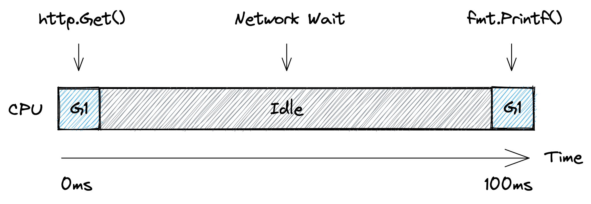
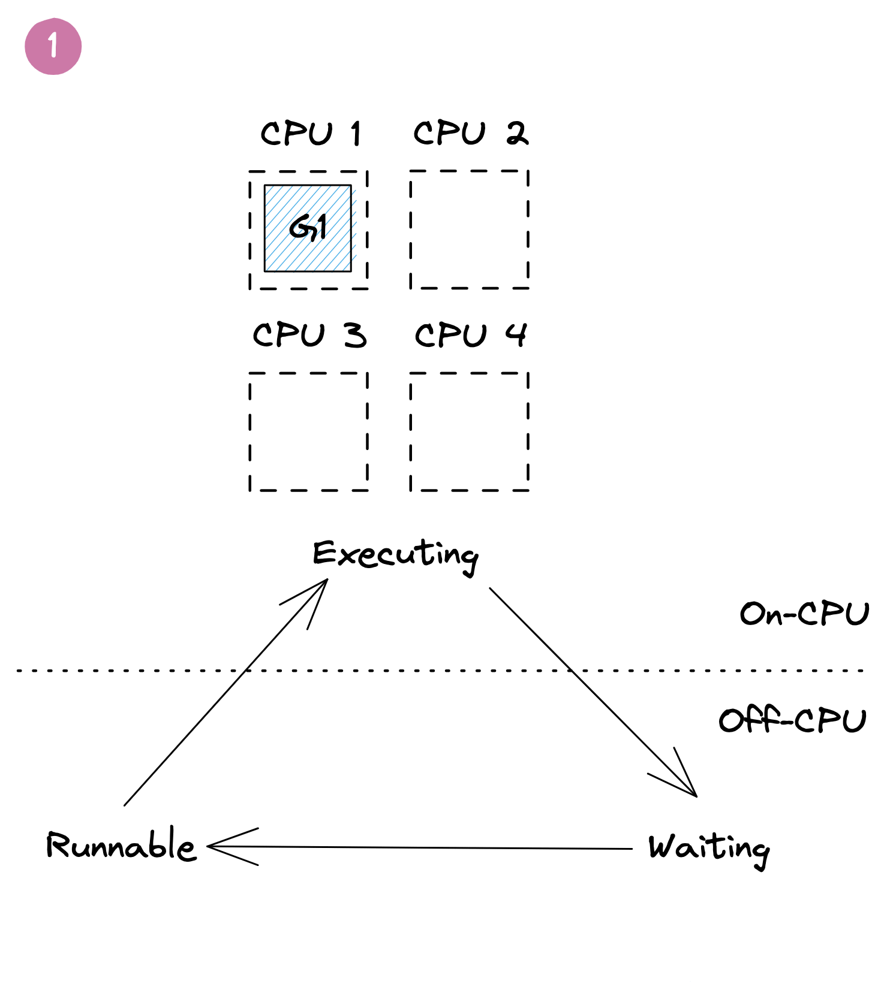
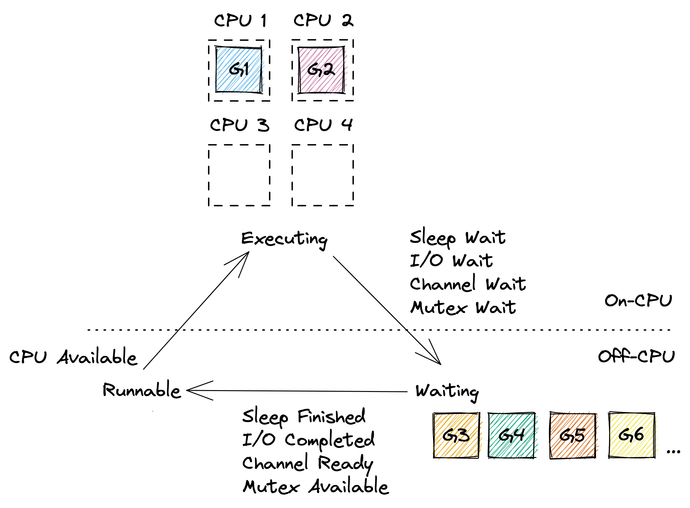
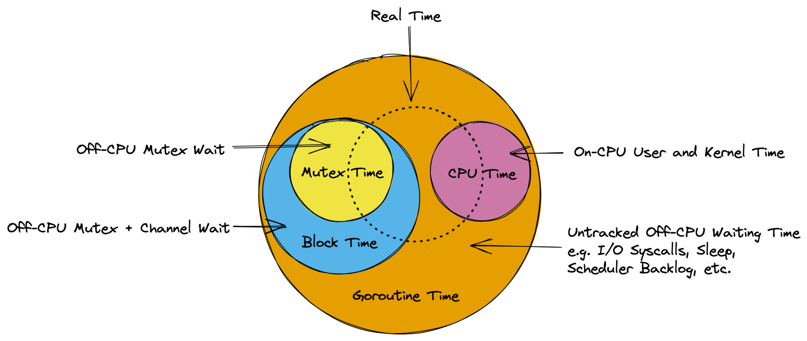
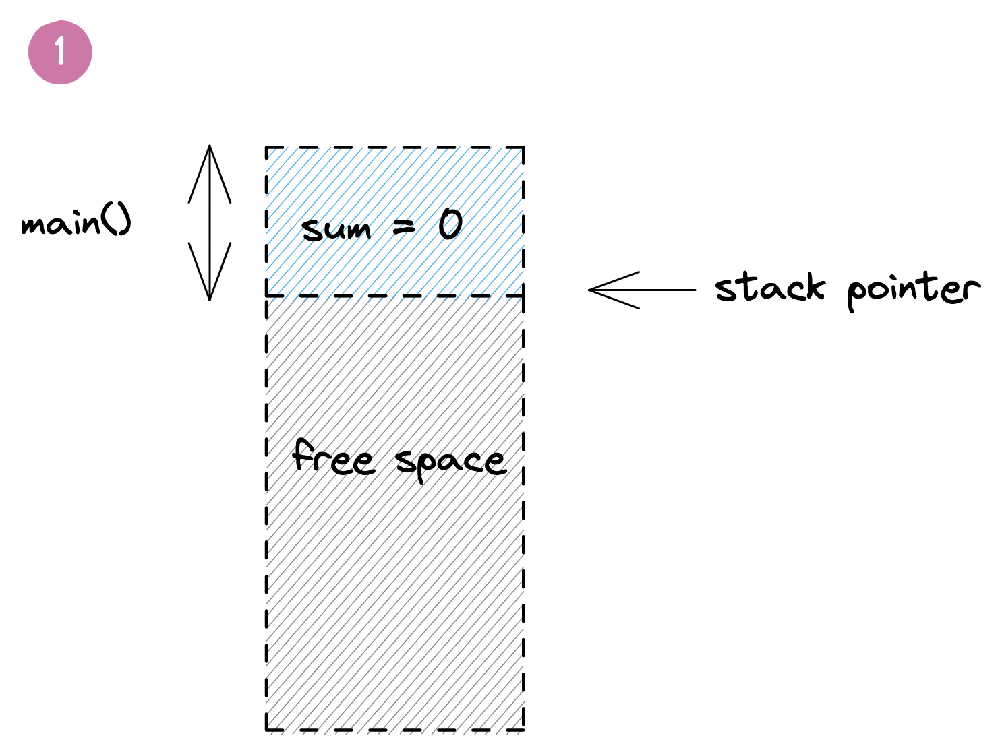
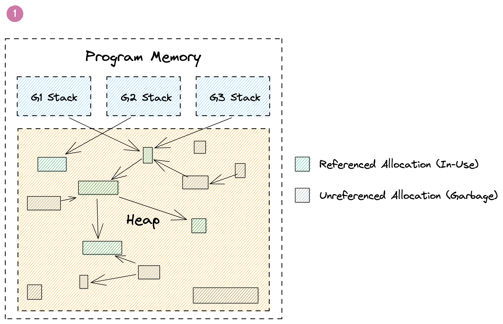

li⬅ [Index of all go-profiler-notes](../README.md)
# 一份给忙碌开发者的 Go Profiling、Tracing 和 Observability 指南

- **[导论](#introduction):** [适合读者](#read-this) · [Go 的认知模型](#mental-model-for-go) · Profiling vs Tracing
- **Use Cases:** Reduce Costs · Reduce Latency · Memory Leaks · Program Hanging · Outages
- **[Go 分析器](#go-profilers)**: [CPU 分析器](#cpu-profiler) · [内存分析器](#memory-profiler) · [阻塞分析器](#block-profiler) · [互斥锁分析器](#mutex-profiler) · [Goroutine分析器](#goroutine-profiler) · [线程创建分析器](#threadcreate-profiler)
- **Viewing Profiles**: Command Line · Flame Graph · Graph
- **Go Execution Tracer:** Timeline View · Derive Profiles
- **Go Metrics:**  MemStats
- **Other Tools:** time · perf · bpftrace
- **[Advanced Topics](#advanced-topics):** Assembly · [Stack Traces](#stack-traces) · [pprof Format](#pprof-format) · Little's Law
- **Datadog Products:** Continuous Profiler · APM (Distributed Tracing) · Metrics

🚧 This document is a work in progress. All sections above will become clickable links over time. The best way to find out about updates is to follow me and [my thread on twitter](https://twitter.com/felixge/status/1435537024388304900) where I'll announce new sections being added.

🚧 本文档正在进行中。随着时间的推移，以上所有部分都将成为可点击的链接。了解最新动态的最佳方式是关注我和我在 twitter 上的帖子，我将在上面宣布添加的内容。

# 导论

## 适合的读者

This is a practical guide aimed at busy gophers interested in improving their programs using profiling, tracing and other observability techniques. If you're not well versed in the internals of Go, it is recommended that you read the entire introduction first. After that you should feel free to jump to any section you are interested in.

这是一本面向有兴趣使用分析(profiling)、跟踪(tracing)和其他可观察性技术(observability techniques)来改进程序的忙碌的Gophers的实用指南。如果你不熟悉 Go 的内部结构，建议你先阅读整个介绍。之后，你应该可以随意跳到你任意感兴趣的部分。

## Mental Model for Go
## Go 的认知模型

It is possible to become quite proficient in writing Go code without understanding how the language works under the hood. But when it comes to performance and debugging, you'll hugely benefit from having a mental model of the internals. Therefore we'll begin with laying out a rudimentary model of Go below. This model should be good enough to allow you to avoid the most common mistakes, but [all models are wrong](https://en.wikipedia.org/wiki/All_models_are_wrong), so you are encouraged to seek out more in-depth material to tackle harder problems in the future.

在不了解 Go 语言的底层工作原理的情况下，你可能会非常精通编写 Go 程序代码。但当涉及到性能和调试问题时，你将会从Go内部的认知模型中受益匪浅。因此我们将首先在下面列出 Go 的基本模型。这个模型应该足够好，可以让你避免最常见的错误，但[All models are wrong](https://en.wikipedia.org/wiki/All_models_are_wrong)，因此鼓励你寻找更深入的资料来解决未来更难的问题。

Go's primary job is to multiplex and abstract hardware resources, similar to an operating system. This is generally accomplished using two major abstractions:

Go 的主要工作是复用(multiplex)和抽象硬件资源(abstract hardware resources)，它类似于操作系统。Go 通常使用下面两个主要抽象来完成：

1. **Goroutine Scheduler:** Manages how your code is being executed on the CPUs of your system.

    **Goroutine 调度器：** 用于控制代码如何在系统 CPU 上的执行

2. **Garbage Collector:** Provides virtual memory that is automatically freed as needed.

    **垃圾回收：** 提供可以根据需要自动释放的虚拟内存


### Goroutine Scheduler

### Goroutine 调度器

Let's talk about the scheduler first using the example below:

我们使用下面这个例子来讨论调度器：

```go
func main() {
    res, err := http.Get("https://example.org/")
    if err != nil {
        panic(err)
    }
    fmt.Printf("%d\n", res.StatusCode)
}
```

Here we have a single goroutine, let's call it `G1`, that runs the `main` function. The picture below shows a simplified timeline of how this goroutine might execute on a single CPU. Initially `G1` is running on the CPU to prepare the http request. Then the CPU becomes idle as the goroutine has to wait for the network. And finally it gets scheduled onto the CPU again to print out the status code.

这里我们有一个单独的 goroutine，我们称之为 G1，它运行 main 函数。下图显示了这个 goroutine 如何在单个 CPU 上执行的简化版时间线。最初 G1 在 CPU 上运行以准备 http 请求。然后 CPU 变得空闲，因为 goroutine 必须等待网络。最后，它再次被调度到 CPU 上以打印出状态码。



From the scheduler's perspective, the program above executes like shown below. At first `G1` is `Executing` on `CPU 1`. Then the goroutine is taken off the CPU while `Waiting` for the network. Once the scheduler notices that the network has replied (using non-blocking I/O, similar to Node.js), it marks the goroutine as `Runnable`. And as soon as a CPU core becomes available, the goroutine starts `Executing` again. In our case all cores are available, so `G1` can go back to `Executing` the `fmt.Printf()` function on one of the CPUs immediately without spending any time in the `Runnable` state.

从调度器的角度来看，上面的程序执行过程如下所示。一开始 G1 在 CPU 1 上执行。接着 goroutine 在由于等待网络时会从 CPU 中taken off。一旦调度器注意到网络已经响应（使用非阻塞 I/O，类似于 Node.js），它会将 goroutine 标记为 `Runnable`。一旦 CPU 内核可用，goroutine 就会再次开始执行。在我们的例子中，所有内核都处于可用状态，因此 G1 可以立即返回到在其中一个 CPU 上执行 fmt.Printf() 函数，而无需花费任何时间处于 `Runnable` 状态。




Most of the time, Go programs are running multiple goroutines, so you will have a few goroutines `Executing` on some of the CPU cores, a large number of goroutines `Waiting` for various reasons, and ideally no goroutines `Runnable` unless your program exhibits very high CPU load. An example of this can be seen below.

大多数时候，Go 程序都在运行多个 goroutine，所以会有几个 goroutine 正在执行在 CPU 内核上，有大量 goroutine 由于各种原因处于`Waiting`，在理想情况下没有 goroutine 处于`Ruannable` 状态，除非你的程序表现出非常高的 CPU 负载。这方面的一个例子可以在下面看到。



Of course the model above glosses over many details. In reality it's turtles all the way down, and the Go scheduler works on top of threads managed by the operating system, and even CPUs themselves are capable of hyper-threading which can be seen as a form of scheduling. So if you're interested, feel free to continue down this rabbit hole via Ardan labs series on [Scheduling in Go](https://www.ardanlabs.com/blog/2018/08/scheduling-in-go-part1.html) or similar material.

当然，上面的模型掩盖了许多细节。实际上，一路向下探究(it's turtles all the way down)，你会发现Go 调度程序工作在操作系统管理的线程之上，甚至 CPU 本身也能够进行超线程处理，这可以看作是一种调度形式。如果你有对此感兴趣的话，可以去阅读 Ardan 实验室[关于 Go 调度](https://www.ardanlabs.com/blog/2018/08/scheduling-in-go-part1.html)文章系列或类似材料。

However, the model above should be sufficient to understand the remainder of this guide. In particular it should become clear that the time measured by the various Go profilers is essentially the time your goroutines are spending in the `Executing` and `Waiting` states as illustrated by the diagram below.

不管怎么说，上面的模型应该足以理解本指南的其余部分。我们尤其应该清楚的是，各种 Go 分析器测量的时间本质上是你的 goroutine 在执行和等待状态中花费的时间，如下图所示。



### Garbage Collector

### 垃圾回收器

The other major abstraction in Go is the garbage collector. In languages like C, the programmer needs to manually deal with allocating and releasing memory using `malloc()` and `free()`. This offers great control, but turns out to be very error prone in practice. A garbage collector can reduce this burden, but the automatic management of memory can easily become a performance bottleneck. This section of the guide will present a simple model for Go's GC that should be useful for identifying and optimizing memory management related problems.

Go 中的另一个主要抽象是垃圾回收器。像 C 这样的语言，程序员需要使用 `malloc()` 和 `free()` 手动处理内存的分配和释放。这提供了很好的控制，但在实践中很容易出错。垃圾回收器可以减轻这种负担，但内存的自动管理很容易成为性能瓶颈。本指南的这一部分将展示一个简单的 Go GC 模型，该模型对于识别和优化内存管理相关问题应该很有用。

#### The Stack

#### 栈

Let's start with the basics. Go can allocate memory in one of two places, the stack or the heap. Each goroutine has its own stack which is a contiguous area of memory. Additionally there is a big area of memory shared between goroutines that is called the heap. This can be seen in the picture below.

让我们从基础开始。 Go 可以在堆栈(stack)或堆(heap)这两个地方之一分配内存。每个 goroutine 都有自己的堆栈，这是一个连续的内存区域。此外，在 goroutine 之间共享的一大块内存区域称为堆。Go的堆栈和堆如下图所示：


When a function calls another function it gets its own section on the stack called a stack frame where it can place things like local variables. A stack pointer is used to identify the next free spot in the frame. When a function returns, the data from the last frame is discarded by simply moving the stack pointer back to end of the previous frame. The frame's data itself can linger on the stack, and gets overwritten by the next function call. This is very simple and efficient as Go doesn't have to keep track of each variable.

当一个函数调用另一个函数时候，它将会从栈上获得自己的空间，这部分空间叫做栈帧(stack frame)，栈帧是用来存局部变量等内容。栈指针用于标识帧中的下一个空闲点。当函数返回时，只需将堆栈指针移回前一帧的末尾即可丢弃最后一帧的数据。栈帧上的数据本身可以在栈上存放，并被下一个函数调用覆盖。这是非常简单和高效的，因为 Go 不必跟踪每个变量。


To make this a little more intuitive, let's look at the example below:
为了上面讨论更直观一点，让我们来看下面的例子：

```go
func main() {
	sum := 0
	sum = add(23, 42)
	fmt.Println(sum)
}

func add(a, b int) int {
	return a + b
}
```

Here we have a `main()` function that starts out by reserving some space on the stack for the variable `sum`. When the `add()` function gets called, it gets its own frame to hold the local `a` and `b` parameters. Once the `add()` returns, its data is discarded by moving the stack pointer back to the end of the `main()` function's frame, and the `sum` variable gets updated with the result. Meanwhile the old values of `add()` linger beyond the stack pointer to be overwritten by the next function call. Below is a visualization of this process:

这里我们有一个 `main()` 函数，它首先在栈上为变量 `sum` 保留一些空间。当 `add()` 函数被调用时，它会使用自己的栈帧空间来保存本地 `a` 和 `b` 参数。一旦 `add()` 返回，它的数据通过将栈指针移回到 `main()` 函数帧的末尾而被丢弃，并且 `sum` 变量被更细为函数`add()`的返回值。同时 `add()` 的旧值在堆栈指针之外徘徊，将被下一个函数调用覆盖。下面是这个过程的可视化：



The example above is highly simplified and omits many details around return values, frame pointers, return addresses and function inlining. In fact, as of Go 1.17, the program above may not even need any space on the stack as the small amount of data can be managed using CPU registers by the compiler. But that's okay. This model should still give you a reasonable intuition for the way non-trivial Go programs allocate and discard local variables on the stack.

上面的例子是高度简化的，省略了很多关于返回值、帧指针、返回地址和函数内联的细节。事实上，从 Go 1.17 开始，上面的程序甚至可能不需要堆栈上的任何空间，因为编译器可以使用 CPU 寄存器管理少量数据。但是没关系。这个模型仍然能够让你对非凡的 Go 程序在堆栈上分配和丢弃局部变量的方式有一个直观感受。

One thing you might wonder at this point is what happens if you run out of space on the stack. In languages like C this would cause a stack overflow error. Go on the other hand automatically deals with this problem by making a copy of the stack that's twice as big. This allows goroutines to start out with very small, typically 2 KiB stacks, and is one of the key ingredients for [making goroutines more scalable](https://golang.org/doc/faq#goroutines) than operating system threads.

你可能想知道如果栈空间不足时候将会发生什么情况？在 C 这样的语言中，它将会导致栈溢出错误（stack overflow error）。然后 Go 是通过复制出两倍大的堆栈来自动处理这个问题，这种方式允许 goroutines 可以从很小的栈空间开始，通常为 2 KiB，也是使 [goroutines 比操作系统线程更具可扩展性](https://golang.org/doc/faq#goroutines)的关键因素之一。

Another aspect of the stack is how it's involved in creating stack traces. This is a bit more advanced, but if you're interested check out the [Stack Traces in Go](../stack-traces.md) document in this repo.

栈的另一个方面是它如何参与创建堆栈跟踪。这话题有点复杂，但如果你有兴趣，请查看此仓库中的关于 [Go 栈跟踪](https://github.com/DataDog/go-profiler-notes/blob/main/stack-traces.md)部分文档。

#### The Heap

#### 堆

Stack allocations are great, but there are many situations where Go can't utilize them. The most common one is returning a pointer to a local variable of a function. This can be seen in this modified version of our `add()` example from above:

栈分配很好，但在很多情况下 Go 无法使用它们。最常见的是返回指向函数局部变量的指针。这可以在上面的 add() 示例的修改版本中看到：

```go
func main() {
	fmt.Println(*add(23, 42))
}

func add(a, b int) *int {
	sum := a + b
	return &sum
}
```

Normally Go would be able to allocate the `sum` variable inside of the `add()` function on the stack. But as we've learned, this data gets discarded when the `add()` function returns. So in order to safely return a `&sum` pointer, Go has to allocate the memory for it from outside of the stack. And that's where the heap comes in.

通常 Go 将能够在栈上为 `add()` 函数内部的 `sum` 变量分配空间。但正如我们上面介绍的那样，当 `add()` 函数返回时，这些数据会被丢弃。因此，为了安全地返回 `&sum` 指针，Go 必须从栈外部为其分配内存。这就是堆的用武之地。

The heap is used for storing data that might outlive the function that creates it, as well as for any data that is shared between goroutines using pointers. However, this raises the question of how this memory gets freed. Because unlike stack allocations, heap allocations can't be discarded when the function that created them returns.

堆用于存储可能比创建它的函数声明周期更长的数据，以及使用指针在 goroutine 之间共享的任何数据。然而这就涉及了如何释放这些内存的问题。因为与栈分配不同，堆分配在创建它们的函数返回时不能被丢弃(discard)。

Go solves this problem using its built-in garbage collector. The details of its implementation are very complex, but from a birds eye view, it keeps track of your memory as shown in the picture below. Here you can see three goroutines that have pointers to green allocations on the heap. Some of these allocations also have pointers to other allocations shown in green. Additionally there are grey allocations that may point to the green allocations or each other, but they are not referenced by a green allocation themselves. Those allocations were once reachable, but are now considered to be garbage. This can happen if the function that allocated their pointers on the stack returned, or their value was overwritten. The GC is responsible for automatically identifying and freeing those allocations.

Go 使用其内置的垃圾回收器(built-in garbage collector)解决了这个问题。它的实现细节非常复杂，但从俯瞰的角度来看，如下图所示，它会跟踪应用程序的内存。下图中，你可以看到三个 goroutine，他们都有指针指向堆上的绿色区域，其中的一些区域还会指向其他的绿色区域。此外，还有指向绿色区域的灰色区域，或者相互指向的灰色区域，但它们不被绿色区域本身引用。这些灰色曾经是可以访问的，但现在被认为是垃圾。如果在堆栈上分配指针的函数返回，或者它们的值被覆盖，就会发生这种情况。 GC 负责自动识别和释放这些区域。



Performing GC involves a lot of expensive graph traversal and cache thrashing. It even requires regular stop-the-world phases that halt the execution of your entire program. Luckily recent versions of Go have gotten this down to fractions of a millisecond, but much of the remaining overhead is inherent to any GC. In fact, it's not uncommon that 20-30% of a Go program's execution are spend on memory management.

执行 GC 操作涉及大量性能损耗在的图遍历(graph traversal)和缓存抖动(cache thrashing)。它甚至需要定期停止整个程序的执行阶段。幸运的是，最近的 Go 版本已将其降低到几分之一毫秒，但大部分剩余开销是任何 GC 所固有的。事实上，Go 程序中 20-30% 的执行花费在内存管理上的情况并不少见。

Generally speaking the cost of GC is proportional to the amount of heap allocations your program performs. So when it comes to optimizing the memory related overhead of your program, the mantra is:

一般来说，GC 的成本与程序执行的堆分配量成正比。因此，在优化程序的内存相关开销时，口头禅是：


- **Reduce**: Try to turn heap allocations into stack allocations or avoid them altogether. Minimizing the number of pointers on the heap also helps.
- **减少使用：** 尝试将堆分配转换为栈分配或完全避免它们。最小化堆上的指针数量也会有所帮助。

- **Reuse:** Reuse heap allocations rather than replacing them with new ones.
- **复用：** 复用分配的堆而不是使用新的来替换它们。

- **Recycle:** Some heap allocations can't be avoided. Let the GC recycle them and focus on other issues.
- **回收：** 一些堆分配是无法避免的。让 GC 回收它们并专注于其他问题。

As with the previous mental model in this guide, everything above is an extremely simplified view of reality. But hopefully it will be good enough to make sense out of the remainder of this guide, and inspire you to read more articles on the subject. One article you should definitely read is [Getting to Go: The Journey of Go's Garbage Collector](https://go.dev/blog/ismmkeynote) which gives you a good idea of how Go's GC has advanced over the years, and the pace at which it is improving.

与本指南中之前的认知模型一样，以上所有内容都是对现实的极其简化的概览，但希望它足以让本指南的其余部分变得有意义，并激励你阅读更多关于该主题的文章。你绝对应该阅读的一篇文章是 [Getting to Go: The Journey of Go's Garbage Collector](https://go.dev/blog/ismmkeynote)，它让你很好地了解 Go 的 GC 多年来是如何发展的，以及它的改进速度。

# Go Profilers

# Go 分析器

Here is an overview of the profilers built into the Go runtime. For more details following the links.

下面是 Go 运行时中内置的分析器的概述。有关更多详细信息，请访问后面的链接。

| | [CPU](#cpu-profiler) | [内存(Memory)](#memory-profiler) | [阻塞(Block)]](#block-profiler) | [互斥锁(Mutex)](#mutex-profiler) | [Goroutine](#goroutine-profiler) | [线程创建(ThreadCreate)](#threadcreate-profiler) |
|-|-|-|-|-|-|-|
|生产环境使用安全性(Production Safety)|✅|✅|⚠ (1.)|✅|⚠️ (2.)|🐞 (3.)|
|安全率(Safe Rate)|default|default|❌ (1.)|`100`|`1000` goroutines|-|
|准确性(Accuracy)|⭐️⭐|⭐⭐⭐|⭐⭐⭐|⭐⭐⭐|⭐⭐⭐|-|
|最大栈深度(Max Stack Depth)|`64`|`32`|`32`|`32`|`32` - `100` (4.)|-|
|分析器标签支持(Profiler Labels)|✅|❌|❌|❌|✅|-|

1. The block profiler can be a significant source of CPU overhead if configured incorrectly. See the [warning](#block-profiler-limitations).
  如果配置不正确，阻塞分析器(block profiler)可能是 CPU 开销的重要来源。详情[见警告]。(#block-profiler-limitations)。
2. One O(N) stop-the-world pauses where N is the number of goroutines. Expect ~1-10µsec pause per goroutine.
  O(N) 的stop-the-world 暂停，N是goroutines的数量，每个goroutine暂停耗时~1-10µsec。
3. Totally broken, don't try to use it.
  不要尝试使用。

4. Depends on the API.
  取决于 API。

<!-- TODO mega snippet to enable all profilers -->

## CPU Profiler

## CPU 分析器

Go's CPU profiler can help you identify which parts of your code base consume a lot of CPU time.

Go 的 CPU 分析器可以帮助你找出代码中的哪些部分消耗大量 CPU 时间。

⚠️ Please note that CPU time is usually different from the real time experienced by your users (aka latency). For example a typical http request might take `100ms` to complete, but only consume `5ms` of CPU time while waiting for `95ms` on a database. It's also possible for a request to take `100ms`, but spend `200ms` of CPU if two goroutines are performing CPU intensive work in parallel. If this is confusing to you, please refer to the [Goroutine Scheduler](#goroutine-scheduler) section.

⚠️ 请注意，CPU 时间通常不同于用户实际体验的时间（也称为延迟）。例如，一个典型的 http 请求可能需要 100 毫秒才能完成，但在数据库上等待 95 毫秒时只消耗 5 毫秒的 CPU 时间。如果两个 goroutine 并行执行 CPU 密集型工作，请求也可能需要 100 毫秒，但会花费 200 毫秒的 CPU。如果这让你感到困惑，请参阅 [Goroutine 调度器](#goroutine-scheduler)部分。

You can control the CPU profiler via various APIs:
你可以通过各种 API 控制 CPU 分析器：

- `go test -cpuprofile cpu.pprof` will run your tests and write a CPU profile to a file named `cpu.pprof`.
- [`pprof.StartCPUProfile(w)`](https://pkg.go.dev/runtime/pprof#StartCPUProfile) captures a CPU profile to `w` that covers the time span until [`pprof.StopCPUProfile()`](https://pkg.go.dev/runtime/pprof#StopCPUProfile) is called.
- [`import _ "net/http/pprof"`](https://pkg.go.dev/net/http/pprof) allows you to request a 30s CPU profile by hitting the `GET /debug/pprof/profile?seconds=30` endpoint of the default http server that you can start via `http.ListenAndServe("localhost:6060", nil)`.
- [`runtime.SetCPUProfileRate()`](https://pkg.go.dev/runtime#SetCPUProfileRate) lets you to control the sampling rate of the CPU profiler. See [CPU Profiler Limitations](#cpu-profiler-limitations) for current limitations.
- [`runtime.SetCgoTraceback()`](https://pkg.go.dev/runtime#SetCgoTraceback) can be used to get stack traces into cgo code. [benesch/cgosymbolizer](https://github.com/benesch/cgosymbolizer) has an implementation for Linux and macOS.

If you need a quick snippet to paste into your `main()` function, you can use the code below:

如果你需要一个快速的代码片段来粘贴到你的 main() 函数中，你可以使用下面的代码：

```go
file, _ := os.Create("./cpu.pprof")
pprof.StartCPUProfile(file)
defer pprof.StopCPUProfile()
```

Regardless of how you activate the CPU profiler, the resulting profile will essentially be a table of stack traces formatted in the binary [pprof](../pprof.md) format. A simplified version of such a table is shown below:

无论你如何触发 CPU 分析器，生成的profile文件本质上都是以二进制 [pprof](../pprof.md) 格式格式化的堆栈跟踪表。这种表格的简化版本如下所示：

|stack trace|samples/count|cpu/nanoseconds|
|-|-|-|
|main;foo|5|50000000|
|main;foo;bar|3|30000000|
|main;foobar|4|40000000|

The CPU profiler captures this data by asking the operating system to monitor the CPU usage of the application and sends it a `SIGPROF` signal for every `10ms` of CPU time it consumes. The OS also includes time consumed by the kernel on behalf of the application in this monitoring. Since the signal deliver rate depends on CPU consumption, it's dynamic and can be up to `N * 100Hz` where `N` is the number of logical CPU cores on the system. When a `SIGPROF` signal arrives, Go's signal handler captures a stack trace of the currently active goroutine, and increments the corresponding values in the profile. The `cpu/nanoseconds` value is currently directly derived from the sample count, so it is redundant, but convenient.

CPU 分析器通过操作系统监控应用程序的CPU 使用情况，并且每隔`10ms`的CPU 片时间发送一个`SIGPROF`信号来捕获profile数据。操作系统还包括内核在此监控中代表应用程序消耗的时间。由于信号传输速率取决于 CPU 消耗，因此它是动态的，最高可达 `N * 100Hz`，其中 `N` 是操作系统上逻辑 CPU 内核的数量。当 `SIGPROF` 信号到达时，Go 的信号处理程序捕获当前活动的 goroutine 的堆栈跟踪，并增加profile文件中的相应值。 `cpu/nanoseconds` 值目前是直接从`samples/count`样本计数中推导出来的，所以是多余的，但是使用方便。

### CPU Profiler Labels

### CPU 分析器标签

A cool feature of Go's CPU profiler is that you can attach arbitrary key value pairs to a goroutine. These labels will be inherited by any goroutine spawned from that goroutine and show up in the resulting profile.

Go 的 CPU 分析器的一个很酷的功能是你可以将任意键值对附加到 goroutine。这些标签将被从该 goroutine 生成的任何 goroutine 继承，并写入到profile文件中。

Let's consider the [example](./cpu-profiler-labels.go) below that does some CPU `work()` on behalf of a `user`. By using the [`pprof.Labels()`](https://pkg.go.dev/runtime/pprof#Labels) and [`pprof.Do()`](https://pkg.go.dev/runtime/pprof#Do) API, we can associate the `user` with the goroutine that is executing the `work()` function. Additionally the labels are automatically inherited by any goroutine spawned within the same code block, for example the `backgroundWork()` goroutine.

让我们考虑下面的例子，它代表用户执行一些 CPU `work()`。通过使用 [pprof.Labels()](https://pkg.go.dev/runtime/pprof#Labels) 和 [pprof.Do()](https://pkg.go.dev/runtime/pprof#Do) API，我们可以将用户与执行 work() 函数的 goroutine 相关联。该标签会被同一代码块中生成的任何 goroutine 自动继承，例如 `backgroundWork()`这个goroutine。

```go
func work(ctx context.Context, user string) {
	labels := pprof.Labels("user", user)
	pprof.Do(ctx, labels, func(_ context.Context) {
		go backgroundWork()
		directWork()
	})
}
```

The resulting profile will include a new label column and might look something like this:

生成的profile文件中将包含一个新的标签列，可能如下所示：

|stack trace|label|samples/count|cpu/nanoseconds|
|-|-|-|-|
|main.childWork|user:bob|5|50000000|
|main.childWork|user:alice|2|20000000|
|main.work;main.directWork|user:bob|4|40000000|
|main.work;main.directWork|user:alice|3|30000000|

Viewing the same profile with pprof's Graph view will also include the labels:
使用 pprof 的 Graph 视图查看相同的profile文件也将包括标签：


How you use these labels is up to you. You might include things such as `user ids`, `request ids`, `http endpoints`, `subscription plan` or other data that can allow you to get a better understanding of what types of requests are causing high CPU utilization, even when they are being processed by the same code paths. That being said, using labels will increase the size of your pprof files. So you should probably start with low cardinality labels such as endpoints before moving on to high cardinality labels once you feel confident that they don't impact the performance of your application.

如何使用这些标签取决于你。你可能会包含诸如`user ids`、`request ids`、`http endpoints`、`subscription plan`或其他数据之类的内容，这些数据可以让你更好地了解哪些类型的请求会导致 CPU 负载高。即使它们是由相同的代码处理的路径，话虽如此，使用标签会增加 pprof 文件的大小。因此，一旦你确信它们不会影响应用程序的性能，你可能应该从类似`http endpoints`等低基数(low cardinality)标签开始，然后再转向高基数(high cardinality)标签。

⚠️ Go 1.17 and below contained several bugs that could cause some profiler labels to be missing from CPU profiles, see [CPU Profiler Limitations](#cpu-profiler-limitations) for more information.

⚠️ Go 1.17 及更低版本包含几个可能导致 CPU profile文件中缺少某些分析器标签的错误，有关更多信息，请参阅[CPU 分析器的限制](#cpu-profiler-limitations)。

### CPU Utilization

### CPU 利用率

Since the sample rate of the CPU profiler adapts to amount of CPU your program is consuming, you can derive the CPU utilization from CPU profiles. In fact pprof will do this automatically for you. For example the profile below was taking from a program that had an average CPU utilization of `147.77%`:

由于 CPU 分析器的采样率会适应你的程序消耗的 CPU 的数量，因此你可以从 CPU profile文件中得出 CPU 利用率。事实上 pprof 会自动为你做这件事。例如，下面的profile文件显示程序的平均 CPU 利用率为 `147.77%` ：

```
$ go tool pprof guide/cpu-utilization.pprof
Type: cpu
Time: Sep 9, 2021 at 11:34pm (CEST)
Duration: 1.12s, Total samples = 1.65s (147.77%)
Entering interactive mode (type "help" for commands, "o" for options)
(pprof) 
```

Another popular way to express CPU utilization is CPU cores. In the example above the program was using an average of `1.47` CPU cores during the profiling period.

表示 CPU 利用率的另一种流行方式是 CPU 核数。在上面的示例中，程序在分析期间平均使用了 1.47 个 CPU 内核。

⚠️ In Go 1.17 and below you shouldn't put too much trust in this number if it's near or higher than `250%`, see [CPU Profiler Limitations](#cpu-profiler-limitations). However, if you see a very low number such as `10%` this usually indicates that CPU consumption is not an issue for your application. A common mistake is to ignore this number and start worrying about a particular function taking up a long time relative to the rest of the profile. This is usually a waste of time when overall CPU utilization is low, as not much can be gained from optimizing this function.

⚠️ 在 Go 1.17 及以下版本中，如果它接近或高于 `250%`，你不要过于相信这个数字，请参阅[CPU 分析器的限制](#cpu-profiler-limitations)。但是，如果你看到一个非常低的数字（例如 10%），这通常表明 CPU 消耗对你的应用程序来说不是问题。一个常见的错误是忽略此数字并开始担心特定功能相对于profile的其余部分会占用很长时间。当整体 CPU 利用率较低时，这通常是浪费时间，因为优化此功能并不能获得太多收益。

### System Calls in CPU Profiles

### CPU profile文件中的系统调用

If you see system calls such as `syscall.Read()` or `syscall.Write()` using a lot of time in your CPU profiles, please note that this is only the CPU time spend inside of these functions in the kernel. The I/O time itself is not being tracked. Spending a lot of time on system calls is usually a sign of making too many of them, so perhaps increasing buffer sizes can help. For more complicated situations like this, you should consider using Linux perf, as it can also show you kernel stack traces that might provide you with additional clues.

如果你在 CPU profile文件中看到诸如 `syscall.Read()` 或 `syscall.Write()` 之类的系统调用使用大量时间，请注意这只是内核中这些函数内部花费的 CPU 时间。I/O 时间本身没有被追踪。在系统调用上花费大量时间通常表明调用过多，因此增加缓冲区大小可能会有所帮助。对于像这样更复杂的情况，你应该考虑使用 Linux perf，因为它还可以向你显示内核堆栈跟踪，这可能会为你提供额外的线索。

<!-- TODO: Write up some implementation details, e.g. mention setitimer(). -->
### CPU Profiler Limitations

### CPU 分析器的限制

There are a few known issues and limitations of the CPU profiler that you might want to be aware of:

有一些已知的CPU分析器的问题和限制，你应该知道和了解：

- 🐞 [GH #35057](https://github.com/golang/go/issues/35057): CPU profiles taken with Go versions <= 1.17 become somewhat inaccurate for programs utilizing more than 2.5 CPU cores. Generally speaking the overall CPU utilization will be underreported, and workload spikes may be underrepresented in the resulting profile as well. This is fixed in Go 1.18. Meanwhile you could try to use Linux perf as a workaround.
  对于使用超过 2.5 个 CPU 内核的程序，使用 Go 版本 <= 1.17 获取的 CPU profile文件变得有些不准确。一般来说，总体 CPU 利用率将被低估，并且工作负载峰值也可能在生成的profile文件中被低估。这在 Go 1.18 中已修复。同时，你可以尝试使用 Linux perf 作为解决方法。
- 🐞 Profiler labels in Go versions <= 1.17 suffered from several bugs.
  Go 版本 <= 1.17 中的 分析器 标签存在几个错误。
  - [GH #48577](https://github.com/golang/go/issues/48577) and [CL 367200](https://go-review.googlesource.com/c/go/+/367200/): Labels were missing for goroutines executing on the system stack, executing C code, or making system calls.
    当goroutine执行在系统栈，执行C代码或者进行系统调用时候，将会丢失分析器标签。
  - [CL 369741](https://go-review.googlesource.com/c/go/+/369741): The first batch of samples in a CPU profile had an off-by-one error causing a misattribution of labels.
    CPU profile文件中的第一批样本有一个错误，导致标签分配错误。
  - [CL 369983](https://go-review.googlesource.com/c/go/+/369983): System goroutines created on behalf of user goroutines (e.g. for garbage collection) incorrectly inherited their parents labels.
    代表用户级 goroutine（例如用于垃圾收集）创建的系统级 goroutine 错误地继承了它们的父标签。
- ⚠️️ You can call [`runtime.SetCPUProfileRate()`](https://pkg.go.dev/runtime#SetCPUProfileRate) to adjust the CPU profiler rate before calling `runtime.StartCPUProfile()`. This will print a warning saying `runtime: cannot set cpu profile rate until previous profile has finished`. However, it still works within the limitation of the bug mentioned above. This issue was [initially raised here](https://github.com/golang/go/issues/40094), and there is an [accepted proposal for improving the API](https://github.com/golang/go/issues/42502).
  你可以在调用 `runtime.StartCPUProfile()` 之前调用 `runtime.SetCPUProfileRate()` 来调整 CPU 分析器速率。这将打印一条警告：`runtime: cannot set cpu profile rate until previous profile has finished`。但是，它仍然可以在上述错误的限制范围内工作。此问题最初是在[此issue](https://github.com/golang/go/issues/40094)中提出的，并且已有一个[已接受的改进 API](https://github.com/golang/go/issues/42502)的提案。
- ⚠️ The maximum number of nested function calls that can be captured in stack traces by the CPU profiler is currently [`64`](https://sourcegraph.com/search?q=context:global+repo:github.com/golang/go+file:src/*+maxCPUProfStack+%3D&patternType=literal). If your program is using a lot of recursion or other patterns that lead to deep stack depths, your CPU profile will include stack traces that are truncated. This means you will miss parts of the call chain that led to the function that was active at the time the sample was taken.
  CPU 分析器可以在堆栈跟踪中捕获的最大嵌套函数调用数目前为 [64](https://sourcegraph.com/search?q=context:global+repo:github.com/golang/go+file:src/*+maxCPUProfStack+%3D&patternType=literal)。如果你的程序使用大量递归(recursion)或其他导致堆栈深度更深的模式，你的 CPU profile文件中的栈跟踪将会被截断。这意味着你将错过调用链的某些部分，这些部分是在采样时处于活动状态的函数。

## Memory Profiler

## 内存分析器

Go's memory profiler can help you identify which parts of your code base perform a lot of heap allocations, as well as how many of these allocations were still reachable during the last garbage collection. Because of this, the profile produced by the memory profiler is also often referred to as a heap profile.


Go 的内存分析器可以帮助你确定代码中的哪些部分执行了大量的堆分配，以及在上次垃圾回收期间这些分配的内存中有多少仍然可以访问。因此，内存分析器生成的profile文件也通常称为堆 profile文件。

Heap memory management related activities are often responsible for up to 20-30% of CPU time consumed by Go processes. Additionally the elimination of heap allocations can have second order effects that speed up other parts of your code due to decreasing the amount of cache thrashing that occurs when the garbage collector has to scan the heap. This means that optimizing memory allocations can often have a better return on investment than optimizing CPU-bound code paths in your program.

与堆内存管理相关的活动通常占 Go 进程消耗的 CPU 时间的 20-30%。此外，由于减少了垃圾回收器必须扫描堆时发生的缓存抖动量，因此消除堆分配可能会产生二阶效应(second order effects)，从而加快代码的其他部分。这意味着优化内存分配通常可以比优化程序中的 CPU密集型(CPU-bound)的代码路径获得更好的投资回报。

⚠️ The memory profiler does not show stack allocations as these are generally much cheaper than heap allocations. Please refer to the [Garbage Collector](#garbage-collector) section for more details.

内存分析器不显示栈分配，因为它们成本通常比堆分配便宜得多。有关详细信息，请参阅[垃圾回收器](#garbage-collector)部分。

You can control the memory profiler via various APIs:
你可以通过各种 API 控制内存分析器：

- `go test -memprofile mem.pprof` will run your tests and write a memory profile to a file named `mem.pprof`.
- [`pprof.Lookup("allocs").WriteTo(w, 0)`](https://pkg.go.dev/runtime/pprof#Lookup) writes a memory profile that contains allocation events since the start of the process to `w`.
- [`import _ "net/http/pprof"`](https://pkg.go.dev/net/http/pprof) allows you to request a 30s memory profile by hitting the `GET /debug/pprof/allocs?seconds=30` endpoint of the default http server that you can start via `http.ListenAndServe("localhost:6060", nil)`. This is also called a delta profile internally.
- [`runtime.MemProfileRate`](https://pkg.go.dev/runtime#MemProfileRate) lets you to control the sampling rate of the memory profiler. See [Memory Profiler Limitations](#memory-profiler-limitations) for current limitations.

If you need a quick snippet to paste into your `main()` function, you can use the code below:

如果你需要一个快速的代码片段来粘贴到你的 `main()` 函数中，你可以使用下面的代码：

```go
file, _ := os.Create("./mem.pprof")
defer pprof.Lookup("allocs").WriteTo(file, 0)
defer runtime.GC()
```

Regardless of how you activate the Memory profiler, the resulting profile will essentially be a table of stack traces formatted in the binary [pprof](../pprof.md) format. A simplified version of such a table is shown below:

无论你如何启用内存分析器，生成的profile文件本质上都是以二进制 [pprof](../pprof.md) 格式格式化的堆栈跟踪表。这种表格的简化版本如下所示：

|stack trace|alloc_objects/count|alloc_space/bytes|inuse_objects/count|inuse_space/bytes|
|-|-|-|-|-|
|main;foo|5|120|2|48|
|main;foo;bar|3|768|0|0|
|main;foobar|4|512|1|128|

A memory profile contains two major pieces of information:

内存profile文件包含下面两个主要信息：

- `alloc_*`: The amount of allocations that your program has made since the start of the process (or profiling period for delta profiles).
  自进程开始（或增量profile文件的分析周期）以来，你的程序已进行的分配量。
- `inuse_*`: The amount of allocations that your program has made that were still reachable during the last GC.
  你的程序在上次 GC 期间仍可访问的分配量。

You can use this information for various purposes. For example you can use the `alloc_*` data to determine which code paths might be producing a lot of garbage for the GC to deal with, and looking at the `inuse_*` data over time can help you with investigating memory leaks or high memory usage by your program.

你可以将这些信息用于各种目的。例如，你可以使用 `alloc_*` 数据来确定哪些代码路径可能会产生大量垃圾供 GC 处理，并且随着时间的推移查看 `inuse_*` 数据可以帮助你分析程序中内存泄漏或高内存使用情况。

<!-- TODO: mention profiles are up to two gcs old -->
### Allocs vs Heap Profile

The [`pprof.Lookup()`](https://pkg.go.dev/runtime/pprof#Lookup) function as well as [net/http/pprof](https://pkg.go.dev/net/http/pprof) package expose the memory profile under two names: `allocs` and `heap`. Both profiles contain the same data, the only difference is that the `allocs` profile has `alloc_space/bytes` set as the default sample type, whereas the `heap` profile defaults to `inuse_space/bytes`. This is used by the pprof tool to decide which sample type to show by default.

[`pprof.Lookup()`](https://pkg.go.dev/runtime/pprof#Lookup) 函数以及 [net/http/pprof](https://pkg.go.dev/net/http/pprof) 包以两个名称公开内存profile文件：`allocs` 和 `heap`。两个profile文件包含相同的数据，唯一的区别是 `allocs` profile文件将 `alloc_space/bytes` 设置为默认样本类型，而`heap` profile文件默认为 `inuse_space/bytes`。 pprof 工具使用它来决定默认显示哪种样本类型。

### Memory Profiler Sampling

### 内存分析器采样

To keep overhead low, the memory profiler uses poisson sampling so that on average only one allocation every `512KiB`
 triggers a stack trace to be taken and added to the profile. However, before the profile is written into the final pprof file, the runtime scales the collected sample values by dividing them through the sampling probability. This means that the amount of reported allocations should be a good estimate of the actual amount of allocations, regardless of the [`runtime.MemProfileRate`](https://pkg.go.dev/runtime#MemProfileRate) you are using.

 为了保持较低的开销，内存分析器使用泊松采样(poisson sampling)，因此平均每 `512KiB` 只有一个分配触发堆栈跟踪以被获取并添加到profile文件中。但是，在将profile文件写入最终 pprof 文件之前，运行时通过将收集的样本值除以采样概率来缩放它们。这意味着报告的分配量应该是对实际分配量的良好估计，无论你使用的是什么 [`runtime.MemProfileRate`](https://pkg.go.dev/runtime#MemProfileRate)。

For profiling in production, you should generally not have to modify the sampling rate. The only reason for doing so is if you're worried that not enough samples are getting collected in situations where very few allocations are taking place.

对于生产中的内存分析，你通常不必修改采样率。这样做的唯一理由是，如果你担心在内存分配很少的情况下收集到的样本不足。

### Memory Inuse vs RSS

### 内存使用与 RSS

A common confusion is looking at the total amount of memory reported by the `inuse_space/bytes` sample type, and noticing that it doesn't match up with the RSS memory usage reported by the operating system. There are various reasons for this:

一个常见的混淆是查看 `inuse_space/bytes` 样本类型报告的内存总量，并注意到它与操作系统报告的 `RSS` 内存使用情况不匹配。这有多种原因：

- RSS includes a lot more than just Go heap memory usage by definition, e.g. the memory used by goroutine stacks, the program executable, shared libraries as well as memory allocated by C functions.
    按照RSS定义，它不仅仅包括 Go 堆内存，还包括goroutine 栈使用的内存、以及程序可执行文件或共享库以及 C 函数分配的内存。
- The GC may decide to not return free memory to the OS immediately, but this should be a lesser issue after [runtime changes in Go 1.16](https://golang.org/doc/go1.16#runtime).
    Go GC 之后并不会立即将空闲内存返回给操作系统，但这在 Go 1.16 中的[运行时更改后](https://golang.org/doc/go1.16#runtime)应该是一个较小的问题。
- Go uses a non-moving GC, so in some cases free heap memory might be fragmented in ways that prevent Go from releasing it to the OS.
    Go 使用非移动 GC，因此在某些情况下，空闲堆内存可能会以碎片化(fragmented)形式阻止 Go 将其释放到操作系统。


### Memory Profiler Implementation

### 内存分析器实现

The pseudo code below should capture the essential aspects of the memory profiler's implementation to give you a better intuition for it. As you can see, the `malloc()` function inside of the Go runtime uses `poisson_sample(size)` to determine if an allocation should be sampled. If yes, a stack trace `s` is taken and used as the key in the `mem_profile` hash map to increment the `allocs` and `alloc_bytes` counters. Additionally the `track_profiled(object, s)` call marks the `object` as a sampled allocation on the heap and associates the stack trace `s` with it.

下面的伪代码(pseudo code)展示捕获内存分析器实现的基本思路，以便为你提供更好的直觉。如你所见，Go 运行时内部的 `malloc()` 函数使用 `poisson_sample(size)` 来确定是否应对该次内存分配进行采样。如果是，则获取堆栈跟踪 `s` 并将其用作 `mem_profile` 哈希表中的键，以增加 `allocs` 和 `alloc_bytes` 计数器。此外，`track_profiled(object, s)` 调用将对象标记为堆上的采样分配，并将堆栈跟踪 `s` 与它相关联。

```
func malloc(size):
  object = ... // allocation magic

  if poisson_sample(size):
    s = stacktrace()
    mem_profile[s].allocs++
    mem_profile[s].alloc_bytes += size
    track_profiled(object, s)

  return object
```

When the GC determines that it is time to free an allocated object, it calls `sweep()` which uses `is_profiled(object)` to check if the `object` is marked as a sampled object. If yes, it retrieves the stack trace `s` that lead to the allocation, and increments the `frees` and `free_bytes` counters for it inside of the `mem_profile`.

当 GC 确定是时候释放分配的对象时，它会调用使用 `is_profiled(object)` 的 `sweep()` 来检查对象是否被标记为采样对象。如果是，它会检索导致分配的堆栈跟踪，并在 `mem_profile` 中为它增加 `frees` 和 `free_bytes` 计数器。

```
func sweep(object):
  if is_profiled(object)
    s = alloc_stacktrace(object)
    mem_profile[s].frees++
    mem_profile[s].free_bytes += sizeof(object)

	// deallocation magic
```

The `free_*` counters themselves are not included in the final memory profile. Instead they are used to calculate the `inuse_*` counters in the profile via simple `allocs - frees` subtraction. Additionally the final output values are scaled by dividing them through their sampling probability.

`free_*` 计数器本身并不包含在最终的内存profile文件中。相反，它们用于通过简单的 `allocs - frees` 运算得到 `inuse_*`。此外，最终输出值通过将它们除以它们的采样概率来缩放。

### Memory Profiler Limitations

### 内存分析器限制

There are a few known issues and limitations of the memory profiler that you might want to be aware of:

你可能需要了解内存分析器的一些已知问题和限制：

- 🐞 [GH #49171](https://github.com/golang/go/issues/49171): Delta profiles (taken with e.g. `GET /debug/pprof/allocs?seconds=60`) may report negative allocation counts due to a symbolization bug involving inlined closures in Go 1.17. It's fixed in Go 1.18.

    由于 Go 1.17 中的涉及内联闭包的符号化错误，Delta profiles（使用例如 `GET /debug/pprof/allocs?seconds=60`）可能会报告负分配计数。这个问题已在 Go 1.18 中修复。
- ⚠️ [`runtime.MemProfileRate`](https://pkg.go.dev/runtime#MemProfileRate) must only be modified once, as early as possible in the startup of the program; for example, at the beginning of `main()`. Writing this value is inherently a small data race, and changing it multiple times during program execution will produce incorrect profiles.

    只能在程序启动时修改一次；例如，在 `main()`函数开始时候。写入这个值会有一个小的数据竞争，并且在程序执行期间多次更改它会产生不正确的profile文件。
- ⚠ When debugging potential memory leaks, the memory profiler can show you where those allocations were created, but it can't show you which references are keeping them alive. A few attempts to solve this problem were made over the years, but none of them work with recent versions of Go. If you know about a working tool, please [let me know](https://github.com/DataDog/go-profiler-notes/issues).

    在调试潜在的内存泄漏(debugging potential memory leaks)时，内存分析器可以显示这些分配是在哪里创建的，但它不能显示哪些引用使它们保持活动状态。多年来，为解决这个问题进行了一些尝试，但没有一个适用于最新版本的 Go。如果你知道一个可用的工具，[请告诉我](https://github.com/DataDog/go-profiler-notes/issues)。
- ⚠ [CPU Profiler Labels](#cpu-profiler-labels) or similar are not supported by the memory profiler. It's difficult to add this feature to the current implementation as it could create a memory leak in the internal hash map that holds the memory profiling data.

    内存分析器不支持 CPU 分析器标签或类似标签。很难将此功能添加到当前实现中，因为它可能会在保存内存分析数据的内部哈希表中造成内存泄漏。
- ⚠ Allocations made by cgo C code don't show up in the memory profile.

    cgo 中 C 代码所做的内存分配不会显示在内存profile文件中。
- ⚠ Memory profile data may be up to two garbage collection cycles old. If you want a more consistent point-in-time snapshot, consider calling `runtime.GC()` before requesting a memory profile. [net/http/pprof](https://pkg.go.dev/net/http/pprof) accepts a `?gc=1` argument for this purpose. For more information see the [runtime.MemProfile()](https://pkg.go.dev/runtime#MemProfile) docs, as well as as the comment on `memRecord` in [`mprof.go`](https://github.com/golang/go/blob/master/src/runtime/mprof.go).

    内存profile文件数据可能最多有两个垃圾回收周期。如果你想要更一致的时间点快照(point-in-time snapshot)，请考虑在请求内存profile文件之前调用 `runtime.GC()`。 [net/http/pprof](https://pkg.go.dev/net/http/pprof) 的 `?gc=1` 参数可以实现这个目的。有关更多信息，请参阅 [runtime.MemProfile()](https://pkg.go.dev/runtime#MemProfile) 文档以及 [`mprof.go`](https://github.com/golang/go/blob/master/src/runtime/mprof.go) 中对 `memRecord` 的评论。

- ⚠️ The maximum number of nested function calls that can be captured in stack traces by the memory profiler is currently [`32`](https://sourcegraph.com/search?q=context:global+repo:github.com/golang/go+file:src/*+maxStack+%3D&patternType=literal), see [CPU Profiler Limitations](#cpu-profiler-limitations) for more information on what happens when you exceed this limit.

    内存分析器可以在栈跟踪中捕获的最大嵌套函数调用数目前为 [`32`](https://sourcegraph.com/search?q=context:global+repo:github.com/golang/go+file:src/*+maxStack+%3D&patternType=literal)，有关超过此限制时会发生什么的更多信息，请参阅 [CPU 分析器限制](#cpu-profiler-limitations)。

- ⚠️ There is no size limit for the internal hash map that holds the memory profile. This means it will grow in size until it covers all allocating code paths in your code base. This is not a problem in practice, but might look like a small memory leak if you're observing the memory usage of your process.

    保存内存profile文件的内部哈希表没有大小限制。这意味着它将不断增长，直到覆盖代码中的所有内存分配代码的路径。这在实践中不是问题，但如果你正在观察进程的内存使用情况，它可能看起来像一个小的内存泄漏。

## Block Profiler

## 阻塞分析器

The block profiler in Go measures how much time your goroutines spend Off-CPU while waiting for channel as well as mutex operations provided by the [sync](https://pkg.go.dev/sync) package. The following Go operations are hooked up to the block profiler:

Go 中的阻塞分析器衡量你的 goroutine 在等待通道以及同步包提供的互斥操作时在 Off-CPU 外花费的时间。以下 Go 操作会被阻塞分析器捕获分析：

- [select](https://github.com/golang/go/blob/go1.15.7/src/runtime/select.go#L511)
- [chan send](https://github.com/golang/go/blob/go1.15.7/src/runtime/chan.go#L279)
- [chan receive](https://github.com/golang/go/blob/go1.15.7/src/runtime/chan.go#L586)
- [semacquire](https://github.com/golang/go/blob/go1.15.7/src/runtime/sema.go#L150) ( [`Mutex.Lock`](https://golang.org/pkg/sync/#Mutex.Lock), [`RWMutex.RLock`](https://golang.org/pkg/sync/#RWMutex.RLock) , [`RWMutex.Lock`](https://golang.org/pkg/sync/#RWMutex.Lock), [`WaitGroup.Wait`](https://golang.org/pkg/sync/#WaitGroup.Wait))
- [notifyListWait](https://github.com/golang/go/blob/go1.15.7/src/runtime/sema.go#L515) ( [`Cond.Wait`](https://golang.org/pkg/sync/#Cond.Wait))

⚠️ Block profiles do not include time spend waiting on I/O, Sleep, GC and various other waiting states. Additionally blocking events are not recorded until they have completed, so the block profile can't be used to debug why a Go program is currently hanging. The latter can be determined using the Goroutine Profiler.

⚠️ 阻塞 profile文件不包括等待 I/O、睡眠、GC 和各种其他等待状态的时间。此外，阻塞事件在完成之前不会被记录，因此阻塞profile文件不能用于调试 Go 程序当前挂起的原因。后者可以使用 Goroutine 分析器 确定。

You can control the block profiler via various APIs:

你可以通过各种 API 控制阻塞分析器：

- `go test -blockprofile block.pprof` will run your tests and write a block profile that captures every blocking event to a file named `block.pprof`.
- [`runtime.SetBlockProfileRate(rate)`](https://pkg.go.dev/runtime#SetBlockProfileRate) lets you to enable and control the sampling rate of the block profiler.
- [`pprof.Lookup("block").WriteTo(w, 0)`](https://pkg.go.dev/runtime/pprof#Lookup) writes a block profile that contains blocking events since the start of the process to `w`.
- [`import _ "net/http/pprof"`](https://pkg.go.dev/net/http/pprof) allows you to request a 30s block profile by hitting the `GET /debug/pprof/block?seconds=30` endpoint of the default http server that you can start via `http.ListenAndServe("localhost:6060", nil)`. This is also called a delta profile internally.


If you need a quick snippet to paste into your `main()` function, you can use the code below:

如果你需要一个快速的代码片段来粘贴到你的 `main()` 函数中，你可以使用下面的代码：

```go
runtime.SetBlockProfileRate(100_000_000) // WARNING: Can cause some CPU overhead
file, _ := os.Create("./block.pprof")
defer pprof.Lookup("block").WriteTo(file, 0)
```

Regardless of how you activate the block profiler, the resulting profile will essentially be a table of stack traces formatted in the binary [pprof](../pprof.md) format. A simplified version of such a table is shown below:

无论你如何激活阻塞分析器，生成的profile文件本质上都是以二进制 [pprof](../pprof.md) 格式格式化的堆栈跟踪表。这种表格的简化版本如下所示：

|stack trace|contentions/count|delay/nanoseconds|
|-|-|-|
|main;foo;runtime.selectgo|5|867549417|
|main;foo;bar;sync.(*Mutex).Lock|3|453510869|
|main;foobar;runtime.chanrecv1|4|5351086|

### Block Profiler Implementation

### 阻塞分析器的实现

The pseudo code below should capture the essential aspects of the block profiler's implementation to give you a better intuition for it. When sending a message to channel, i.e. `ch <- msg`, Go invokes the `chansend()` function in the runtime that is shown below. If the channel is `ready()` to receive the message, the `send()` happens immediately. Otherwise the block profiler captures the `start` time of the blocking event and uses `wait_until_ready()` to ask the scheduler to move the goroutine off the CPU until the channel is ready. Once the channel is ready, the blocking `duration` is determined and used by `random_sample()` along with the sampling `rate` to decide if this block event should be recorded. If yes, the current stack trace `s` is captured and used as a key inside of the `block_profile` hash map to increment the `count` and `delay` values. After that the actual `send()` operation proceeds.

下面的伪代码将展示阻塞分析器实现的基本思路，以便为你提供更好的直觉。，如下所示，当向通道发送消息时，即 `ch <- msg`，Go 会在运行时调用 `chansend()` 函数。如果通道已经是`ready()`准备好接收消息，`send()` 会立即调用。否则阻塞分析器捕获阻塞事件的开始时间并使用 `wait_until_ready()` 要求调度程序将 goroutine 移出 CPU，直到通道准备好。一旦通道准备好，阻塞持续时间由 `random_sample()` 确定并使用采样率来决定是否应该记录这个阻塞事件。如果需要记录，则捕获当前堆栈跟踪 `s` 并将其用作 `block_profile` 哈希表内的键以增加计数和延迟值。之后，`send()` 操作继续进行。

```
func chansend(channel, msg):
  if ready(channel):
    send(channel, msg)
    return

  start = now()
  wait_until_ready(channel) // Off-CPU Wait
  duration = now() - start

  if random_sample(duration, rate):
    s = stacktrace()
    // note: actual implementation is a bit trickier to correct for bias
    block_profile[s].contentions += 1
    block_profile[s].delay += duration

  send(channel, msg)
```

The `random_sample` function looks like shown below. If the block profiler is enabled, all events where `duration >= rate` are captured, and shorter events have a `duration/rate` chance of being captured.

`random_sample` 函数看起来如下所示。
```
func random_sample(duration, rate):
  if rate <= 0 || (duration < rate && duration/rate > rand(0, 1)):
    return false
  return true
```

In other words, if you set `rate` to `10.000` (the unit is nanoseconds), all blocking events lasting `10 µsec` or longer are captured. Additionally `10%` of events lasting `1 µsec` and `1%` of events lasting `100 nanoseconds`, and so on, are captured as well.

换句话说，如果你将 `rate` 设置为 `10.000`（单位为纳秒），则会捕获所有持续10纳秒或更长的阻塞事件。此外，还会捕获 10% 的持续 1 微秒的事件和 1% 的持续 100 纳秒的事件，依此类推。

### Block vs Mutex Profiler

### 阻塞分析与互斥锁分析器

Both block and mutex profiler report time waiting on mutexes. The difference is that the block profiler captures the time waiting to acquire a `Lock()`, whereas the mutex profiler captures the time another goroutine was waiting before `Unlock()` allowed it to proceed.

阻塞分析器和互斥量分析器都报告互斥量等待时间。不同之处在于阻塞分析器捕获等待获取 `Lock()` 的时间，而互斥锁分析器捕获另一个 goroutine 在 `Unlock()` 允许它继续之前等待的时间。

In other words, the block profiler shows you which goroutines are experiencing increased latency due to mutex contentions whereas the mutex profiler shows you the goroutines that are holding the locks that are causing the contention.

换句话说，阻塞分析器向你显示哪些 goroutine 由于互斥争用而导致延迟增加，而互斥锁分析器显示持有导致竞态的锁的 goroutine。

### Block Profiler Limitations

### 阻塞分析器的限制

- 🚨 The block profiler can cause significant CPU overhead in production, so it's recommended to only use it for development and testing. If you do need to use it in production, start out with a very high rate, perhaps 100 million, and lower it only if needed. In the past this guide recommended a rate of `10,000` as safe, but we saw production workloads suffering up to 4% overhead under this setting, and even rates up to 10 million were not sufficient to significantly reduce the overhead.

    阻塞分析器可能会导致生产中的大量 CPU 开销(CPU overhead)，因此建议仅将其用于开发和测试。如果你确实需要在生产中使用它，请以非常高的速率开始，比如1亿，并且仅在需要时降低它。过去，本指南建议将 `10,000` 的速率作为一个安全值，但我们看到在此设置下生产工作负载的开销高达 4%，即使高达 1000 万的速率也不足以显着降低开销。
- ⚠ Block profiles cover only a small subset of [Off-CPU waiting states](https://github.com/golang/go/blob/go1.17.1/src/runtime/runtime2.go#L1053-L1081) a goroutine can enter.
    阻塞profile文件仅涵盖 goroutine 可以进入的 [Off-CPU 等待状态](https://github.com/golang/go/blob/go1.17.1/src/runtime/runtime2.go#L1053-L1081)的一小部分。

- ⚠️ The maximum number of nested function calls that can be captured in stack traces by the memory profiler is currently [`32`](https://sourcegraph.com/search?q=context:global+repo:github.com/golang/go+file:src/*+maxStack+%3D&patternType=literal), see [CPU Profiler Limitations]
(#cpu-profiler-limitations) for more information on what happens when you exceed this limit.

    内存分析器可以在堆栈跟踪中捕获的最大嵌套函数调用数目前为 [`32`](https://sourcegraph.com/search?q=context:global+repo:github.com/golang/go+file:src/*+maxStack+%3D&patternType=literal)，有关超过此限制时会发生什么的更多信息，请参阅 [CPU 分析器限制](#cpu-profiler-limitations)。

- ⚠️ There is no size limit for the internal hash map that holds the block profile. This means it will grow in size until it covers all blocking code paths in your code base. This is not a problem in practice, but might look like a small memory leak if you're observing the memory usage of your process.

    保存阻塞profile文件的内部哈希表没有大小限制。这意味着它将不断增长，直到覆盖代码中的所有阻塞代码路径。这在实践中不是问题，但如果你正在观察进程的内存使用情况，它可能看起来像一个小的内存泄漏。

- ⚠ [CPU Profiler Labels](#cpu-profiler-labels) or similar are not supported by the block profiler. It's difficult to add this feature to the current implementation as it could create a memory leak in the internal hash map that holds the memory profiling data.
    阻塞分析器不支持 CPU 分析器标签或类似标签。很难将此功能添加到当前实现中，因为它可能会在保存阻塞profile数据的内部哈希表时，造成内存泄漏。

- 🐞 Go 1.17 fixed a long-standing [sampling bias bug in the block profiler](../block-bias.md). Older versions of Go will overreport the impact of infrequent long blocking events over frequent short events.

    Go 1.17 修复了块分析器中长期存在的[采样偏差错误](../block-bias.md)。旧版本的 Go 会夸大不频繁的长阻塞事件对频繁的短事件的影响。

## Mutex profiler

## 互斥锁分析器

The mutex profiler measures how long goroutines spend blocking other goroutines. In other words, it measures the sources of lock contention. The mutex profiler can capture contention coming from `sync.Mutex` and `sync.RWMutex`.

互斥锁分析器衡量 goroutines 阻塞其他 goroutines 的时间。换句话说，它衡量锁争用的来源。互斥锁分析器可以捕获来自`sync.Mutex` 和`sync.RWMutex` 的争用。

⚠️ Mutex profiles do not include other sources of contention such as `sync.WaitGroup`, `sync.Cond`, or accessing file descriptors. Additionally, mutex contention is not recorded until the mutex is unlocked, so the mutex profile can't be used to debug why a Go program is currently hanging. The latter can be determined using the Goroutine Profiler.

Mutex profile文件不包括其他竞态来源源，例如 `sync.WaitGroup`、`sync.Cond` 或访问文件描述符。此外，在互斥锁解锁之前不会记录互斥锁争用，因此互斥锁配置文件不能用于调试 Go 程序当前挂起的原因。后者可以使用 Goroutine 分析器 确定。

You can control the mutex profiler via various APIs:

你可以通过各种 API 控制互斥锁分析器：

- `go test -mutexprofile mutex.pprof` will run your tests and write a mutex profile to a file named `mutex.pprof`.
- [`runtime.SetMutexProfileRate(rate)`](https://pkg.go.dev/runtime#SetMutexProfileRate) lets you to enable and control the sampling rate of the mutex profiler. If you set a sampling rate of `R`, then an average of `1/R` mutex contention events are captured. If the rate is 0 or less, nothing is captured.
- [`pprof.Lookup("mutex").WriteTo(w, 0)`](https://pkg.go.dev/runtime/pprof#Lookup) writes a mutex profile that contains mutex events since the start of the process to `w`.
- [`import _ "net/http/pprof"`](https://pkg.go.dev/net/http/pprof) allows you to request a 30s mutex profile by hitting the `GET /debug/pprof/mutex?seconds=30` endpoint of the default http server that you can start via `http.ListenAndServe("localhost:6060", nil)`. This is also called a delta profile internally.


If you need a quick snippet to paste into your `main()` function, you can use the code below:

如果你需要一个快速的代码片段来粘贴到你的 `main()` 函数中，你可以使用下面的代码：

```go
runtime.SetMutexProfileFraction(100)
file, _ := os.Create("./mutex.pprof")
defer pprof.Lookup("mutex").WriteTo(file, 0)
```

The resulting mutex profile will essentially be a table of stack traces formatted in the binary [pprof](../pprof.md) format. A simplified version of such a table is shown below:

生成的互斥锁profile文件本质上是一个以二进制 [pprof](../pprof.md) 格式格式化的堆栈跟踪表。这种表格的简化版本如下所示：

|stack trace|contentions/count|delay/nanoseconds|
|-|-|-|
|main;foo;sync.(*Mutex).Unlock|5|867549417|
|main;bar;baz;sync.(*Mutex).Unlock|3|453510869|
|main;foobar;sync.(*RWMutex).RUnlock|4|5351086|

⚠️ See the section on [block vs mutex profiles](#block-vs-mutex-profiler) for the difference between the two profiles.

⚠️ 有关阻塞profile和互斥锁profile这两个profile文件之间的区别，请参[阻塞profile和互斥锁profile](#block-vs-mutex-profiler)部分。

### Mutex profiler implementation

### 互斥锁分析的实现

The mutex profiler is implemented by recording the time from when a goroutine tries to acquire a lock (e.g. `mu.Lock()`) to when the lock is released by the goroutine holding the lock (e.g. `mu.Unlock()`). First, a goroutine calls `semacquire()` to take the lock, and records the time it started waiting if the lock is already held. When the goroutine holding the lock releases it by calling `semrelease()`, the goroutine will look for the next goroutine waiting for the lock, and see how long that goroutine spent waiting. The current mutex profiling value `rate` is used to randomly decide whether to record this event. If it's randomly chosen, the blocking time is recorded to a `mutex_profile` hash map keyed by the call stack where the goroutine released the lock.

互斥锁分析器是通过记录从 goroutine 尝试获取锁（例如 `mu.Lock()`）到持有锁的 goroutine 释放锁（例如 `mu.Unlock()`）的时间来实现的。首先，一个 goroutine 调用 `semacquire()` 来获取锁，并记录它开始等待的时间，如果锁已经被持有。当持有锁的 goroutine 通过调用 `semrelease()` 释放它时，goroutine 将寻找下一个等待锁的 goroutine，并查看该 goroutine 等待了多长时间。当前互斥锁分析值速率用于随机决定是否记录此事件。如果它是随机选择的，则阻塞时间将记录到由 goroutine 释放锁的调用堆栈键的 `mutex_profile` 哈希表。

In pseudocode:

```
func semacquire(lock):
  if lock.take():
    return

  start = now()
  waiters[lock].add(this_goroutine(), start)
  wait_for_wake_up()

func semrelease(lock):
  next_goroutine, start = waiters[lock].get()
  if !next_goroutine:
    // If there weren't any waiting goroutines, there is no contention to record
    return

  duration = now() - start
  if rand(0,1) < 1 / rate:
    s = stacktrace()
    mutex_profile[s].contentions += 1
    mutex_profile[s].delay += duration

  wake_up(next_goroutine)
```

### Mutex Profiler Limitations

### 互斥锁分析器的限制

The mutex profiler has limitations similar to the block profiler:

互斥锁分析器的限制和阻塞分析器限制类似：

- ⚠️ The maximum number of nested function calls that can be captured in stack traces by the mutex profiler is currently [`32`](https://sourcegraph.com/search?q=context:global+repo:github.com/golang/go+file:src/*+maxStack+%3D&patternType=literal), see [CPU Profiler Limitations](#cpu-profiler-limitations) for more information on what happens when you exceed this limit.

    互斥锁分析器在堆栈跟踪中可以捕获的嵌套函数调用的最大数量当前为 [`32`](https://sourcegraph.com/search?q=context:global+repo:github.com/golang/go+file:src/*+maxStack+%3D&patternType=literal)，请参阅 [CPU 探查器限制]（#cpu-profiler-limitations)以获取有关超出此限制时会发生什么的更多信息。
- ⚠️ There is no size limit for the internal hash map that holds the mutex profile. This means it will grow in size until it covers all blocking code paths in your code base. This is not a problem in practice, but might look like a small memory leak if you're observing the memory usage of your process.

    保存互斥锁profile文件的内部哈希表没有大小限制。这意味着它将不断增长，直到覆盖代码中的所有阻塞代码路径。这在实践中不是问题，但如果你正在观察进程的内存使用情况，它可能看起来像一个小的内存泄漏。
- ⚠ [CPU Profiler Labels](#cpu-profiler-labels) or similar are not supported by mutex profiler. It's difficult to add this feature to the current implementation as it could create a memory leak in the internal hash map that holds the memory profiling data.
    互斥锁分析器不支持 [CPU 分析器标签](#cpu-profiler-labels)或类似标签。很难将此功能添加到当前实现中，因为它可能会在保存内存分析数据的内部哈希表中造成内存泄漏。
- ⚠️ The contention counts and delay times in a mutex profile are adjusted at reporting time based on the *most recent* configured sampling rate, rather than at sample time. As a result, programs which change the mutex profile fraction in the middle of execution can see skewed counts and delays.

    互斥锁profile文件中的争用计数和延迟时间在报告时**根据最近配置的采样率进行调整，而不是在采样时进行调整**。因此，在执行过程中更改互斥锁profile文件fraction的程序可能会看到倾斜的计数和延迟。

## Goroutine Profiler

## Goroutine 分析器

This profiler is currently documented in a separate document, see [goroutine.md](../goroutine.md). It will be integrated into this document soon.

此分析器当前记录在单独的文档中，请参阅 [goroutine.md](../goroutine.md)。它将很快集成到本文档中。

## ThreadCreate Profiler

## 线程创建分析器

🐞 The threadcreate profile is intended to show stack traces that led to the creation of new OS threads. However, it's been [broken since 2013](https://github.com/golang/go/issues/6104), so you should stay away from it.

线程创建 profile文件旨在显示导致创建新 OS 线程的堆栈跟踪。但是它[自 2013 年以来就坏掉了](https://github.com/golang/go/issues/6104)，所以你应该不要再使用它。

# Advanced Topics

# 高级主题

## Stack Traces

## 栈追踪

This is currently documented in a separate document, see [stack-traces.md](../stack-traces.md). It will be integrated into this document soon.

这目前记录在一个单独的文档中，请参阅 [stack-traces.md](../stack-traces.md)。它将很快集成到本文档中。


## pprof Format

## pprof 格式

This is currently documented in a separate document, see [pprof.md](../pprof.md). It will be integrated into this document soon.

这目前记录在一个单独的文档中，请参阅 [pprof.md](../pprof.md)。它将很快集成到本文档中。

# Disclaimers

# 免责声明

I'm [felixge](https://github.com/felixge) and work at [Datadog](https://www.datadoghq.com/) on [Continuous Profiling](https://www.datadoghq.com/product/code-profiling/) for Go. You should check it out. We're also [hiring](https://www.datadoghq.com/jobs-engineering/#all&all_locations) : ).

The information on this page is believed to be correct, but no warranty is provided. Feedback is welcome!

Credits:
- [Nick Ripley](https://github.com/nsrip-dd) for contributing the [Mutex Profiler](#mutex-profiler) section.

<!--
Notes:

- Heap: Maybe a good article to link: https://medium.com/@ankur_anand/a-visual-guide-to-golang-memory-allocator-from-ground-up-e132258453ed
- GC Cost: O(N) with regards to live allocations on the heap containing pointers.
- Each pointer slot in an allocation has a cost! Even nil pointers.
- Reducing Costs: Talk about CPU, Memory and Networking. Is it possible to profile the latter?
- pprof: Maybe host a service to convert perf.data files into pprof files?
- Reuse cute gophers from conf talks.
- pprof cli tips from rhys h. on gopher slack: Favorite options include edgefraction=0, nodefraction=0, and nodecount of something larger than 80 (but rendering gets slow). Plus focus, and an ever-growing regexp (as I dive in to the profile) in ignore.
- https://profiler.firefox.com/ can view linux perf files? With time axis? see https://www.markhansen.co.nz/profiler-uis/

-->
