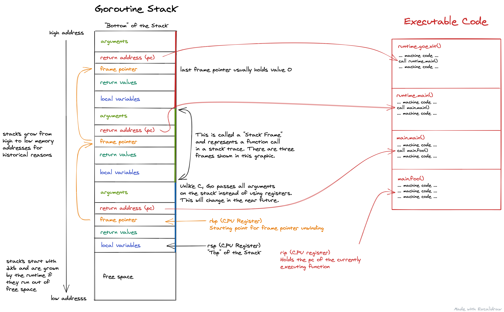
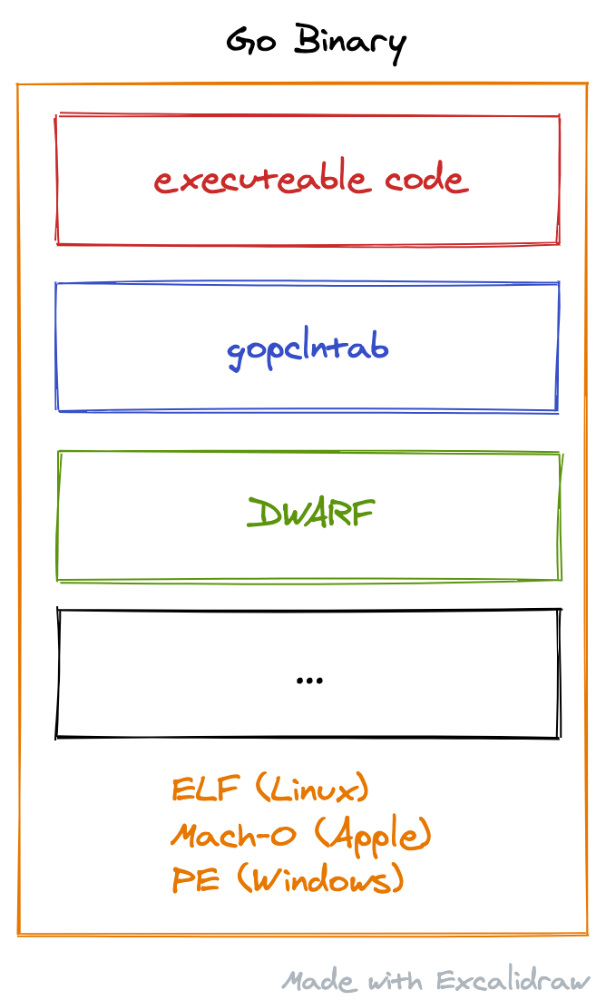

⬅ [Index of all go-profiler-notes](./README.md)

[Introduction](#intrudction) - [Goroutine Stack](#goroutine-stack) ([Stack Layout](#stack-layout), [Real Example](#real-example), [cgo](#cgo)) - [Unwinding](#unwinding) ([Frame Pointer](#frame-pointer), [gopclntab](#gopclntab), [DWARF](#dwarf)) - [Symbolization](#symbolization)


本文档最后一次更新适用于 `go1.16`，但可能仍适用于大多数部分的Go 旧版本或最新版本。


# Go 栈追踪

栈追踪在 Go 分析中起着至关重要的作用。因此让我们尝试了解它们，看看它们如何影响我们profile文件的负载(overhead)和准确性(accuracy)。

## 简介

所有 Go 分析器通过收集栈追踪样本并将它们放入 [pprof profile文件](./pprof.md) 来工作。忽略一些细节，pprof profile文件只是记录栈追踪的频次表，格式如下所示：

| stack trace  | count |
| ------------ | ----- |
| main;foo     | 5     |
| main;foo;bar | 3     |
| main;foobar  | 4     |

让我们放大上表中的第一个栈追踪：`main;foo`。 Go 开发人员通常会更熟悉看到如下所示的由 `panic()` 或 [`runtime.Stack()`](https://golang.org/pkg/runtime/#Stack) 呈现的栈追踪：

```
goroutine 1 [running]:
main.foo(...)
	/path/to/go-profiler-notes/examples/stack-trace/main.go:9
main.main()
	/path/to/go-profiler-notes/examples/stack-trace/main.go:5 +0x3a
```

这种文本格式[已经在别处介绍过了](https://www.ardanlabs.com/blog/2015/01/stack-traces-in-go.html)，所以我们不会在这里讨论它的细节。相反，我们将更深入地研究这些数据的来源。

## Goroutine 栈

顾名思义(As the name implies)，栈跟踪源自“栈”。即使细节有所不同，大多数编程语言都有栈的概念，并使用它来存储局部变量、参数、返回值和返回地址等内容。生成栈追踪通常涉计到一个进程中的栈导航，这个被称为 [Unwinding](#unwinding)，稍后会对其进行更详细的描述。

`x86-64` 等平台为 C 语言定义了[栈布局](https://eli.thegreenplace.net/2011/09/06/stack-frame-layout-on-x86-64)和[调用约定](https://github.com/hjl-tools/x86-psABI/wiki/x86-64-psABI-1.0.pdf)，并鼓励其他编程语言采用它来实现**互操作性**(interoperability)。 Go 不遵循这些约定，而是使用自己的[特殊调用约定](https://dr-knz.net/go-calling-convention-x86-64.html)。 Go 的未来版本（1.17中已实现）将采用更传统的[基于寄存器的调用约定](https://go.googlesource.com/proposal/+/refs/changes/78/248178/1/design/40724-register-calling.md)，以提高性能。然而即使是新的约定也不会与平台兼容(platform-compatible)，因为这会对 goroutine 的可伸缩性产生负面影响(negatively impact)。

Go 的栈布局在不同平台上略有不同。为了使事情易于管理，我们将假设我们在本文档的其余部分使用 `x86-64`。

### 栈布局

现在让我们仔细看看栈。每个 `goroutine` 都有自己的堆栈，大小至少 [2 KiB](https://sourcegraph.com/search?q=repo:golang/go+repo:%5Egithub%5C.com/golang/go%24+_StackMin+%3D&patternType=literal)，并且从高内存地址向低内存地址增长。这可能有点令人困惑，因为按照历史惯例，地址空间有限，栈与程序使用的其他内存区域可能会冲突。

下图显示了当前调用 `main.foo()` 的示例 goroutine 的堆栈，就像我们上面的示例一样：



这张图片中发生了很多事情，但现在让我们关注以红色突出显示的内容。要获得栈跟踪，我们首先需要的是当前程序计数器（`pc`）。这可以在称为 `rip`（指令指针寄存器）的 CPU 寄存器中找到，并指向保存我们程序的可执行机器代码的另一个内存区域。由于我们当前正在调用 `main.foo()` `rip` 指向该函数中的指令。如果你不熟悉寄存器，可以将它们视为访问速度极快的特殊 CPU 变量。其中一些，如 `rip`、`rsp` 或 `rbp` 具有特殊用途，而其他一些可以由编译器根据需要使用。

现在我们知道了当前函数的程序计数器(program counter)，是时候找到调用者的 `pc` 值了，比如所有的返回地址 (pc) 值也以红色突出显示。有多种技术可以做到这一点，我将在[Unwinding](#unwinding)部分中介绍。最终结果是代表栈追踪的程序计数器列表，就像你可以从 [runtime.Callers()](https://golang.org/pkg/runtime/#Callers) 获得的一样。最后但同样重要的是，这些 `pc` 值通常被翻译成人类可读的文件/行/函数名称，如下面的[符号化(Symbolization)](#symbolization)部分所述。在 Go 本身中，你可以简单地调用 [runtime.CallerFramers()](https://golang.org/pkg/runtime/#CallersFrames) 来表示 `pc` 值列表。

### 真实的例子

查看漂亮的图片可能是深入了解堆栈的好方法，但它有其局限性。有时你需要查看原始的位和字节才能全面了解。如果你对此不感兴趣，请随时跳到下一部分。

要查看堆栈，我们将使用 [delve](https://github.com/go-delve/delve)，它是 Go 中的一个出色调试器。为了检查堆栈，我编写了一个名为 [stackannotate.star](./delve/stackannotate.star) 的脚本，该脚本可用于打印带注释的堆栈，一个简单的示例程序如下：

```
$ dlv debug ./examples/stackannotate/main.go 
Type 'help' for list of commands.
(dlv) source delve/stackannotate.star
(dlv) continue examples/stackannotate/main.go:19
Breakpoint 1 set at 0x1067d94 for main.bar() ./examples/stackannotate/main.go:19
> main.bar() ./examples/stackannotate/main.go:19 (hits goroutine(1):1 total:1) (PC: 0x1067d94)
    14:	}
    15:	
    16:	func bar(a int, b int) int {
    17:		s := 3
    18:		for i := 0; i < 100; i++ {
=>  19:			s += a * b
    20:		}
    21:		return s
    22:	}
(dlv) stackannotate
regs    addr        offset  value               explanation                     
        c00004c7e8       0                   0  ?                               
        c00004c7e0      -8                   0  ?                               
        c00004c7e8     -16                   0  ?                               
        c00004c7e0     -24                   0  ?                               
        c00004c7d8     -32             1064ac1  return addr to runtime.goexit   
        c00004c7d0     -40                   0  frame pointer for runtime.main  
        c00004c7c8     -48             1082a28  ?                               
        c00004c7c0     -56          c00004c7ae  ?                               
        c00004c7b8     -64          c000000180  var g *runtime.g                
        c00004c7b0     -72                   0  ?                               
        c00004c7a8     -80     100000000000000  var needUnlock bool             
        c00004c7a0     -88                   0  ?                               
        c00004c798     -96          c00001c060  ?                               
        c00004c790    -104                   0  ?                               
        c00004c788    -112          c00001c060  ?                               
        c00004c780    -120             1035683  return addr to runtime.main     
        c00004c778    -128          c00004c7d0  frame pointer for main.main     
        c00004c770    -136          c00001c0b8  ?                               
        c00004c768    -144                   0  var i int                       
        c00004c760    -152                   0  var n int                       
        c00004c758    -160                   0  arg ~r1 int                     
        c00004c750    -168                   1  arg a int                       
        c00004c748    -176             1067c8c  return addr to main.main        
        c00004c740    -184          c00004c778  frame pointer for main.foo      
        c00004c738    -192          c00004c778  ?                               
        c00004c730    -200                   0  arg ~r2 int                     
        c00004c728    -208                   2  arg b int                       
        c00004c720    -216                   1  arg a int                       
        c00004c718    -224             1067d3d  return addr to main.foo         
bp -->  c00004c710    -232          c00004c740  frame pointer for main.bar      
        c00004c708    -240                   0  var i int                       
sp -->  c00004c700    -248                   3  var s int
```

该脚本并不完美，堆栈中有一些地址暂时无法自动注释（欢迎贡献！）。但一般来说，你应该能够使用它来检查你对前面介绍的抽象堆栈图的理解。

如果你想自己尝试一下，也许可以修改示例程序以生成 `main.foo()` 作为 goroutine 并观察它如何影响堆栈。

### cgo

上述 Go 的堆栈实现在与使用遵循平台调用约定（如 C）的语言编写的代码进行交互时做出了重要的权衡(important tradeoff)。Go 不能直接调用此类函数，而是必须执行复杂的程序来在 goroutine 栈和系统分配的栈(OS-allocated stacks)之间切换来运行 C 代码。这带来了一定的性能开销(performance overhead)，并且还为在分析期间捕获栈追踪带来了复杂的问题，请参阅 [runtime.SetCgoTraceback()](https://golang.org/pkg/runtime/#SetCgoTraceback)。

🚧 我将在以后尝试更详细地描述这一点。

## Unwinding

Unwinding（也称为堆栈遍历）是从堆栈中收集所有返回地址（参见[堆栈布局](#stack-layout)中的红色部分）的过程。它们与当前指令指针寄存器 (`rip`) 一起形成程序计数器 (`pc`) 值列表，可以通过[符号化](#symbolization)将其转换为人类可读的栈追踪。

Go 运行时包括内置分析器，专门使用 [gopclntab](#gopclntab) 来unwinding。但是，我们将首先描述[栈帧指针](#frame-pointer)展开，因为它更容易理解并且将来可能会得到支持。之后，我们还将讨论 [DWARF](#dwarf)，它是unwind Go 堆栈的另一种方式。

对于那些不熟悉它的人，下面是一个简单的图表，显示了我们将在这里讨论的典型 Go 二进制文件的相关部分。它们总是包装在 ELF、Mach-O 或 PE 容器格式中，具体取决于操作系统。



### 栈帧指针(Frame pointer)

栈帧指针 unwinding是指跟随基指针寄存器 (`rbp`) 到堆栈上的第一个栈帧指针的简单过程，该指针指向下一栈帧指针，依此类推。换句话说，它遵循堆栈布局图形中的橙色线。对于每个访问过的栈帧指针，沿途收集位于栈帧指针上方 8 个字节的返回地址 (`pc`)。就是这样 ： ）。

栈帧指针的主要缺点是在正常程序执行期间将它们压入堆栈会为每个函数调用增加一些性能开销。 Go 作者在 [Go 1.7 发行说明](https://golang.org/doc/go1.7)中估计平均程序的平均执行开销为 2%。另一个数据点是 Linux 内核，其中观察到 [5 - 10% 的开销](https://lore.kernel.org/lkml/20170602104048.jkkzssljsompjdwy@suse.de/T/#u)，例如sqlite 和 pgbench。因此，诸如 gcc 之类的编译器提供了诸如 `-fomit-frame-pointers` 之类的选项来省略它们以获得更好的性能。然而，这是一个讨价还价的交易：它会立即为你带来很小的性能优势，但会降低你在未来调试和诊断性能问题的能力。因此，一般建议是：

> 始终使用栈帧指针进行编译。省略栈帧指针是一种邪恶的编译器优化，它会破坏调试器，可悲的是，它通常是默认设置。 – [Brendan Gregg](http://www.brendangregg.com/perf.html)

在 Go 中，你甚至不需要这个建议。因为 Go 1.7 栈帧指针默认为 64 位二进制文​​件启用，并且不支持 `-fomit-frame-pointers`。这允许 Go 与第三方调试器和分析器兼容，例如开箱即用的 [Linux perf](http://www.brendangregg.com/perf.html)。

如果你想看一个简单的栈帧指针unwinding实现，你可以查看[这个项目](https://github.com/felixge/gounwind)，它有一个轻量级的 `runtime.Callers()` 替代方案。与下面描述的其他展开方法相比，简单性不言自明。还应该清楚的是，栈帧指针unwinding展开具有 `O(N)` 时间复杂度，其中 `N` 是需要遍历的堆栈帧的数量。

尽管看起来很简单，但栈帧指针unwinding并不是灵丹妙药。栈帧指针由被调用者入栈，因此对于基于中断的分析，存在固有的竞争条件，可能会导致你错过栈追踪中当前函数的调用者。此外，单独栈帧指针unwindin无法识别内联函数调用。因此，至少 [gopclntab](#gopclntab) 或 [DWARF](#dwarf) 的一些复杂性对于实现准确展开是必不可少的。

### gopclntab

尽管在 64 位平台上可以使用栈帧指针，但 Go 并没有利用它们来进行unwinding（[这可能会改变](https://github.com/golang/go/issues/16638)）。相反，Go 附带了自己的特殊展开表，这些表嵌入 Go 二进制文件的 `gopclntab` 部分中。 `gopclntab` 代表"go program counter line table"，但这有点用词不当，因为它包含unwinding和符号化(symbolization)所需的各种表和元数据。

就unwinding而言，一般的想法是在 `gopclntab` 中嵌入一个“虚拟栈帧指针表”（它被称为 `pctab`），它将程序计数器（`pc`）映射到堆栈指针（`rsp`）和它上面的返回地址（`pc`）。此表中的初始查找使用 `rip` 指令指针寄存器中的 `pc`，然后使用返回地址 (`pc`) 进行下一次查找，依此类推。这样，无论堆栈上是否有物理帧指针，你都可以随时unwinding。

Russ Cox 最初在他的 [Go 1.2 Runtime Symbol Information](https://golang.org/s/go12symta) 文档中描述了一些涉及的数据结构，但是现在它已经非常过时了，最好直接查看当前的实现。相关文件是 [runtime/traceback.go](https://github.com/golang/go/blob/go1.16.3/src/runtime/traceback.go) 和 [runtime/symtab.go](https://github.com/golang/go/blob/go1.16.3/src/runtime/symtab.go)，让我们深入了解一下。

Go 的栈追踪实现的核心是 [`gentraceback()`](https://github.com/golang/go/blob/go1.16.3/src/runtime/traceback.go#L76-L86) 函数，该函数被从各个地方调用。如果调用者是例如`runtime.Callers()` 函数只需要unwinding，但是例如`panic()` 需要文本输出，这也需要符号化。此外，代码必须处理与 x86 略有不同的[链接寄存器架构](https://en.wikipedia.org/wiki/Link_register)（如 ARM）之间的差异。这种unwinding、符号化、对不同架构的支持和定制数据结构的组合对于 Go 团队的系统开发人员来说可能只是日常工作，但对我来说绝对是棘手的，所以请注意我的潜在不准确之处下面的描述。

每个栈帧查找都从当前的 `pc` 开始，该 `pc` 会被传递给 [`findfunc()`](https://github.com/golang/go/blob/go1.16.3/src/runtime/symtab.go#L671) 去查找包含该 `pc` 的函数的元数据。从历史上看，这是使用 `O(log N)` 复杂度的二叉搜索完成的，但[现在](https://go-review.googlesource.com/c/go/+/2097/)有一个类似哈希映射的 [`findfuncbucket`](https://github.com/golang/go/blob/go1.16.3/src/runtime/symtab.go#L671) 结构索引，通常使用 `O(1)` 算法直接引导我们找到正确的条目。


我们刚刚检索(retrieved)到的 [_func](https://github.com/golang/go/blob/9baddd3f21230c55f0ad2a10f5f20579dcf0a0bb/src/runtime/runtime2.go#L825) 元数据包含 `pctab` 表中的 `pcsp` 偏移量，该表将程序计数器映射到栈指针增量(stack pointer deltas)。为了解码这些信息，我们需调用 [`funcspdelta()`](https://github.com/golang/go/blob/go1.16.3/src/runtime/symtab.go#L903) 对所有改变函数的 `sp delta` 的程序计数器进行线性搜索，直到找到最接近的 (`pc`, `sp delta`) 对。对于具有递归调用周期的堆栈，使用小型程序计数器缓存来避免做大量重复工作。

现在我们有了栈指针增量，我们几乎准备好定位调用者的下一个`return address (pc)`值并对其进行相同的查找，直到我们到达堆栈的“底部”。但在此之前，我们需要检查当前 `pc` 是否是一个或多个内联函数调用的一部分。这是通过检查当前 `_func` 的 `_FUNCDATA_InlTree` 数据并对该表中的 (`pc`, `inline index`) 对进行另一次线性搜索来完成的。以这种方式找到的任何内联调用都会将虚拟堆栈帧 pc 添加到列表中。然后我们继续使用段落开头提到的`return address (pc)`。

综上所述，在合理的假设下，`gocplntab` unwinding的有效时间复杂度与栈帧指针unwinding相同，即 `O(N)`，其中 `N` 是堆栈上的帧数，但具有更高的常量开销。这可以通过[实验进行验证](https://github.com/DataDog/go-profiler-notes/tree/main/examples/stack-unwind-overhead)的，但对于大多数应用来说，一个好的经验法则是假设unwinding栈跟踪的成本约为 `1µs`。因此，如果你的目标是在生产中实现 < 1% 的 CPU 分析开销，则应尝试将分析器配置为不跟踪每个内核每秒超过 ~10k 的事件。这是相当数量的数据，但对于某些工具，如[内置跟踪器](https://golang.org/pkg/runtime/trace/)堆栈unwinding可能是一个重大瓶颈。在未来，这可以通过 Go 核心添加对栈帧指针unwinding的支持来解决，这可能比当前的 `gopclntab` 实现[快 50 倍](https://github.com/felixge/gounwind)。


最后但同样重要的是，值得注意的是 Go 附带了两个 `.gopclntab` 实现。除了我刚才描述的那个之外，[debug/gosym](https://golang.org/pkg/debug/gosym/) 包中还有一个似乎被链接器、`go tool addr2line` 等使用的。如果你愿意，你可以将它自己与 [debug/elf](./examples/pclnttab/linux.go) 或 ([debug/macho](./examples/pclnttab/darwin.go)) 结合使用，作为你自己的 [gopclntab 历险记](./examples/pclnttab) 善或者[恶](https://tuanlinh.gitbook.io/ctf/golang-function-name-obfuscation-how-to-fool-analysis-tools)起点。

### DWARF


[DWARF](https://en.wikipedia.org/wiki/DWARF) 是一种标准化的调试格式，许多调试器（例如 [delve](https://github.com/go-delve/delve)）和分析器（例如 Linux [perf](http://www.brendangregg.com/perf.html)）都可以理解。在 `gopclntab` 中支持更多功能，包括unwinding 和 symbolization(符号表)，但是实现很复杂。我们都是知道，Linux 内核拒绝采用 `DWARF` unwinding 内核堆栈追踪。

> The whole (and *only*) point of unwinders is to make debugging easy when a bug occurs [...]. An unwinder that is several hundred lines long is simply not even *remotely* interesting to me.
> – [Linus Torvalds](https://lkml.org/lkml/2012/2/10/356)

[ORC unwinder](https://www.kernel.org/doc/html/latest/x86/orc-unwinder.html) 是内核中[另一种可用](https://lwn.net/Articles/728339/)的unwinding 机制(unwinding mechanism)。然而，ORC 对 Go 堆栈跟踪没有任何作用，我们只需要在这研究ELF 和 DWARF。

Go 编译器总会生成 DWARF (v4) 信息，该信息格式是标准 DWARF (v4) 格式。不像 `gopclntab`，外部工具是可以使用该DWARF信息。DWARF 数据在 `gopclntab` 中也很大程度上是冗余的，并且会对构建时间和大小产生负面影响。因此，Rob Pike 建议默认禁用它，但仍在讨论中。

与 `gopclntab` 不同，DWARF 信息可以在构建时轻松地从二进制文件中剔除掉，如下所示：

```
go build -ldflags=-w <pkg>
```

DWARF 的内部运作方式，其[官方规范](http://dwarfstd.org/)中有长达460页的介绍。对我们来说 DWARF 是 [gopclntab](#gopclntab) 的超集并且两者工作方式非常相似，就足够了。 如果你有将 pc 地址映射到堆栈指针增量的表，那么你无需栈帧指针即可unwinding堆栈。

## 符号化（Symbolization）

符号化是获取一个或多个程序计数器 (pc) 地址并将其转换为人类可读符号（例如函数名、文件名和行号）的过程。例如，如果你有两个这样的 pc 值：

```
0x1064ac1
0x1035683
```

你可以使用符号化将它们转换为人类可读的堆栈跟踪，如下所示：

```
main.foo()
	/path/to/go-profiler-notes/examples/stack-trace/main.go:9
main.main()
	/path/to/go-profiler-notes/examples/stack-trace/main.go:5
```

Go 运行时符号化使用的是 [gopclntab](#gopclntab) 部分中包含的符号信息。此信息也可以通过 [`runtime.CallerFramers()`](https://golang.org/pkg/runtime/#CallersFrames) 访问。

Linux perf 之类的第3方分析器不能使用 [gopclntab](#gopclntab)，而必须依赖 [DWARF](#dwarf) 进行符号化。

## History

In order to support 3rd profilers such as [perf](http://www.brendangregg.com/perf.html) the  [Go 1.7](https://golang.org/doc/go1.7) (2016-08-15) release started to enable frame pointers by default for [64bit binaries](https://sourcegraph.com/search?q=framepointer_enabled+repo:%5Egithub%5C.com/golang/go%24+&patternType=literal).

## Credits

A big thanks goes to [Michael Pratt](https://github.com/prattmic) for [reviewing](https://github.com/DataDog/go-profiler-notes/commit/6a62d5908079ddac9c92d319f49fde846f329c55#r49179154) parts of the `gopclntab` section in this document and catching some significant errors in my analysis.

## Disclaimers

I'm [felixge](https://github.com/felixge) and work at [Datadog](https://www.datadoghq.com/) on [Continuous Profiling](https://www.datadoghq.com/product/code-profiling/) for Go. You should check it out. We're also [hiring](https://www.datadoghq.com/jobs-engineering/#all&all_locations) : ).

The information on this page is believed to be correct, but no warranty is provided. Feedback is welcome!